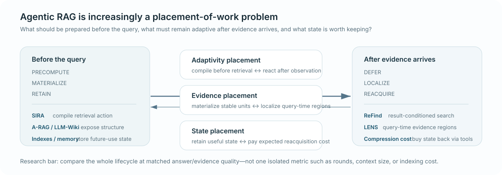

# Agentic RAG Radar

[中文](README.md) | **English**

A living research map of agent-controlled retrieval, evidence access, and information-state management.

Use this radar to answer: **where should retrieval intelligence live, when should evidence be materialized, what state should persist, and what does adaptivity actually buy?**

**Research Radar family:** [Agent Benchmark Radar](https://github.com/H20Zhang/Agent-Benchmark-Radar) · [Agent Memory](https://github.com/H20Zhang/Agent-Memory-Radar) · **Agentic RAG** · [Data Agent](https://github.com/H20Zhang/Data-Agent-Radar)

[30 sec: Timeline](#timeline) · [3 min: 7/30-day changes](#periods) · [5 min: Field Map](#field-map) · [15 min: Reading Paths](#reading-paths) · [Browse all](#library)

**Status:** Last updated: **2026-09-04** · Last synthesized: **2026-09-04T01:53:14Z (UTC)**

## Latest Timeline

> **Migration notice:** Historic Radar acceptance timestamps were not stored for these six legacy records. They are ordered by original paper date and are not presented as newly accepted by the Radar. Post-v2 entries use `radar_published_at` while preserving `published_at`.

2026-09-04 · CoBRA · Adaptivity placement → counterfactual retrieval routing <!-- timefirst:area=counterfactual-retrieval-routing --> — Replaces query-difficulty/final-reward routing targets with the same-query marginal utility of internal versus external routes. <!-- timefirst:delta=counterfactual-retrieval-routing -->

**Question.** For the same query, can a policy learn whether external retrieval is worth more than internal knowledge rather than use difficulty, uncertainty, or final reward as a proxy? <!-- timefirst:question=counterfactual-route-utility -->

**Evidence.** Under the same warm initialization, MARS Avg jEM is **0.5418** versus **0.5066** without reference-split rollouts, **0.4866** without per-branch normalization, and **0.4817** without the branch-margin term. RS branches share the system prompt, tool schema, and reference policy. <!-- timefirst:evidence=counterfactual-routing~mars-avg-jem -->

**Caveat.** Initial margins come from two separately SFTed experts; MARS ablations also change realized tool-call rates, while `Util` prices only `0.10 × #Tool` rather than matching token / latency / evidence volume (token-latency-evidence-volume budget) or dollars. <!-- timefirst:caveat=counterfactual-routing~token-latency-evidence-volume -->

**Map.** `early_signal`: counterfactual retrieval routing is a new adaptivity coordinate; one Qwen3/Wikipedia study does not change the durable Field Map.

**Links.** [CoBRA: Learning Tool-Use Boundaries via Counterfactual Margins](https://arxiv.org/abs/2609.00967) · [English deep note](papers/2609.00967.md) · [Chinese deep note](papers/2609.00967.zh.md)

2026-09-03 · Skill Following · Interface resolution → retrieval-invoked actual use <!-- timefirst:area=retrieval-invoked-actual-use --> — Separates selective retrieval coverage from whether retrieved content improves the same task once the agent actually invokes it. <!-- timefirst:delta=retrieval-invoked-actual-use -->

**Question.** When an agent chooses to retrieve, did the retrieval-to-answer chain help that same task rather than merely select a different task subset? <!-- timefirst:question=retrieval-invoked-actual-use -->

**Evidence.** Gemini-2.5-Flash-lite shows an aggregate / RAE sign reversal on three MBPP+ partitions: **+6.2/-15.6**, **+16.2/-15.9**, and **+4.4/-22.2**; HumanEval+ is **-0.1/-21.1**. <!-- timefirst:evidence=retrieval-invoked-actual-use~aggregate-rae-sign-reversal -->

**Caveat.** RAE conditions on the skill-enabled retrieval subset, a post-treatment selection; the disabled run also removes the search tool, and full token/tool/latency accounting is absent. <!-- timefirst:caveat=retrieval-invoked-actual-use~skill-enabled-retrieval-subset -->

**Map.** `early_signal`: retrieval-invoked actual use is a useful evaluation coordinate; one procedural-skill study does not change the durable Field Map.

**Links.** [Skill Following: Evaluating Actual Skill Use in Retrieval-Enabled LLM Agents](https://arxiv.org/abs/2609.00549) · [English deep note](papers/2609.00549.md) · [Chinese deep note](papers/2609.00549.zh.md)

2026-09-01 · ITER · Adaptivity placement → interaction-conditioned retrieval <!-- timefirst:area=interaction-conditioned-retrieval --> — Moves trajectory history into the retriever: ranking targets marginal evidence utility given what the agent already explored, not current-query relevance alone. <!-- timefirst:delta=interaction-conditioned-retrieval -->

**Question.** With the ranked interface fixed, should the retriever know what the agent has already searched and consumed? <!-- timefirst:question=interaction-conditioned-retrieval -->

**Evidence.** Same Qwen3-Embedding-0.6B family: LRAT / ITER SQ-only / default ITER score **72.7/76.7/80.0** on InfoSeek-Eval and **43.4/43.7/46.6** on BrowseComp-Plus; default ITER beats LRAT in all 12 cells across six agent backbones. <!-- timefirst:evidence=interaction-conditioned-retrieval~qwen3-embedding-0.6b-family -->

**Caveat.** Success-conditioned trajectories plus LLM verifier labels; collection de-duplicates candidate exposure, and history-encoder token/latency cost is unreported. <!-- timefirst:caveat=interaction-conditioned-retrieval~llm-verifier-labels -->

**Map.** `early_signal`: interaction-conditioned retrieval is a useful placement variable; one retriever study does not change the durable map.

**Links.** [ITER: Interaction-Aware Retrieval for Agentic Search](https://arxiv.org/abs/2608.27912) · [English deep note](papers/2608.27912.md) · [Chinese deep note](papers/2608.27912.zh.md)

2026-09-01 · WeAgent-MMSearch · Evidence materialization → multimodal evidence persistence <!-- timefirst:area=multimodal-evidence-persistence --> — Makes cross-turn visibility of tool-returned images an explicit harness variable instead of treating a found image as a one-shot observation. <!-- timefirst:delta=multimodal-evidence-persistence -->

**Question.** After retrieval returns visual evidence, can later search/reasoning steps still access the original modality? <!-- timefirst:question=multimodal-evidence-persistence -->

**Evidence.** Same WeAgent-MMSearch-RL and WeAgent-Harness tool interface, removing only image re-feed: eight-task average **55.97→46.89**; MMBrowseComp **28.13→13.69** and VisTarget **30.22→10.44**. <!-- timefirst:evidence=multimodal-evidence-persistence~weagent-mmsearch-rl -->

**Caveat.** The larger package also changes data, RL, runtime recovery cache semantics; budgets are caps rather than matched realized cost. <!-- timefirst:caveat=multimodal-evidence-persistence~runtime-recovery-cache-semantics -->

**Map.** `early_signal`: multimodal evidence persistence is an independent materialization/interface variable; one harness study does not change the durable map.

**Links.** [WeAgent-MMSearch: Native Text-Vision Interaction for Multimodal Search Agents](https://arxiv.org/abs/2608.28062) · [English deep note](papers/2608.28062.md) · [Chinese deep note](papers/2608.28062.zh.md)

2026-09-01 · ContextPilot · State persistence → proactive context management <!-- timefirst:area=proactive-context-management --> — Treats working context as editable state: the agent plans, retains, compresses, or offloads, with fine-grained RL credit around key edit actions. <!-- timefirst:delta=proactive-context-management -->

**Question.** In long-horizon search, which state should remain materialized, what should be offloaded, and can that policy be trained separately? <!-- timefirst:question=proactive-context-management -->

**Evidence.** In the Qwen3-8B staged ablation, +Context → +Fine-grained moves NovelQA/∞Bench/LME-S/BC+ from **83.05/73.94/61.40/51.08** to **83.88/75.25/64.27/54.18**, improving all four cells. <!-- timefirst:evidence=proactive-context-management~qwen3-8b-staged-ablation -->

**Caveat.** The full method expands tool surface, SFT, partial-rollout credit assignment together; the tool ablation is cumulative on a larger model, and complete lifecycle cost is unmatched. <!-- timefirst:caveat=proactive-context-management~partial-rollout-credit-assignment -->

**Map.** `early_signal`: proactive context management is a state-policy placement; one package does not change the durable Field Map.

**Links.** [ContextPilot: Teaching Agents for Proactive Context Management via Fine-grained RL](https://arxiv.org/abs/2608.28476) · [Code](https://github.com/Tencent/ContextPilot) · [English deep note](papers/2608.28476.md) · [Chinese deep note](papers/2608.28476.zh.md)

2026-08-28 · AWM · Evidence materialization → answerable working memory <!-- timefirst:area=answerable-working-memory --> — Treats terminal working memory as a separate evidence artifact: even after the right page is reached, state must still support answering once page context is removed. <!-- timefirst:delta=answerable-working-memory -->

**Question.** After retrieval reaches relevant pages, can agent-written working state remain an independent bottleneck? <!-- timefirst:question=post-retrieval-memory-answerability -->

**Evidence.** Same Qwen3-VL-4B family: Answer-GRPO → AWM-GRPO final accuracy is **51.6→53.9 / 57.4→60.1**; with EP-given gold evidence pages, final/memory-only accuracy **45.4/41.2→48.0/43.5** and `Pmmc` **19.1%→16.4%**. <!-- timefirst:evidence=awm-controlled~gold-evidence-pages -->

**Caveat.** Reward-supervision cost: two additional frozen reader passes (Qwen3-14B) per rollout; memory-only answerability depends on one reader/judge and is not claim-level source grounding. <!-- timefirst:caveat=awm-boundary~frozen-reader-passes -->

**Map.** `early_signal`: evidence reached, evidence preserved, and evidence grounded should be measured separately; one VQA study does not alter the durable map.

**Links.** [AWM: Answerable Working Memory for Long-Document VQA Agents](https://arxiv.org/abs/2608.25618) · [Code](https://github.com/DongzhuoranZhou/AWM) · [English deep note](papers/2608.25618.md) · [中文深读](papers/2608.25618.zh.md)

2026-08-27 · EviGraph · Evidence materialization → span-grounded evidence construction <!-- timefirst:area=span-grounded-evidence-construction --> — Writes verified source spans into claim-level support/conflict state that drives the next search and stopping decision. <!-- timefirst:delta=span-grounded-evidence-construction -->

**Question.** Can evidence be materialized from a linear search trace into auditable claim–evidence state that controls later acquisition? <!-- timefirst:question=explicit-claim-evidence-state -->

**Evidence.** Same dual-role architecture on BrowseComp-Plus: no-RL **26.9% → RL 35.9%** while search volume is essentially unchanged and generated tokens fall. <!-- timefirst:evidence=evigraph-controlled~dual-role-architecture -->

**Caveat.** Privileged verifier: the frozen verifier decides spans and polarity; the structural validator guarantees provenance/invariants only, with incomplete page-token/latency/dollar accounting. <!-- timefirst:caveat=evigraph-boundary~page-token-latency-dollar -->

**Map.** `early_signal`: explicit evidence state is a representation/control point worth isolating, but one paper does not establish graph state as a general direction.

**Links.** [EviGraph: Towards Verifiable Evidence Construction for Information-Seeking Agents](https://arxiv.org/abs/2608.24667) · [English deep note](papers/2608.24667.md) · [中文深读](papers/2608.24667.zh.md)

2026-08-27 · CAFE · Adaptivity placement → feedback-request routing <!-- timefirst:area=co-evolving-feedback-routing --> — Makes corrective feedback a learnable in-trajectory intervention while the critic follows on-policy failures. <!-- timefirst:delta=co-evolving-feedback-routing -->

**Question.** Can a search policy learn when feedback is worth requesting while its critic co-adapts to the policy's changing failure distribution? <!-- timefirst:question=feedback-request-and-recovery -->

**Evidence.** Same feedback-SFT family: CAFE **52.5 EM / 60.7 F1** versus GRPO **49.7 / 58.0**; component ablations support both shaping terms. <!-- timefirst:evidence=cafe-controlled~feedback-sft-family -->

**Caveat.** Schedule-and-cost confound: different alternation schedules at the same 500 online steps materially change results, and full token/tool/latency cost of extra feedback calls is unmatched. <!-- timefirst:caveat=cafe-boundary~500-online-steps -->

**Map.** `early_signal`: adaptivity can include when to buy a corrective intervention, but the full package does not isolate co-evolution itself.

**Links.** [CAFE: Self-Improving Search Agents Need Co-Evolving Feedback](https://arxiv.org/abs/2608.24794) · [English deep note](papers/2608.24794.md) · [中文深读](papers/2608.24794.zh.md)

2026-08-27 · Crase · Interface resolution → structurally bounded exploration <!-- timefirst:area=structurally-bounded-exploration --> — After seeding, fixes candidate space and stopping in a citation graph instead of letting the model keep deciding whether to search. <!-- timefirst:delta=structurally-bounded-exploration -->

**Question.** When domain structure is strong enough, can open-ended exploration and stopping move from policy into an auditable structural substrate? <!-- timefirst:question=bounded-versus-open-ended-search -->

**Evidence.** ICLR: Crase **R@50 0.3659** versus **0.1220** for both deep-research baselines, with 5 vs 17–18 calls, 235K vs 560–620K tokens, 104 vs 249–272s, and $0.37 vs $1.76–$2.06. <!-- timefirst:evidence=crase-iclr~iclr-crase-r -->

**Caveat.** Unmatched output/substrate: Crase returns ranked scholarly papers and changes corpus/model/retrieval substrate relative to proprietary deep-research baselines, so boundedness is not isolated. <!-- timefirst:caveat=crase-boundary~corpus-model-retrieval-substrate -->

**Map.** `early_signal`: open-ended adaptivity should compete with structurally bounded alternatives under the same output contract and cost budget.

**Links.** [Structurally-bounded Agentic Graph Exploration for Evidence-Grounded Scholarly DeepSearch](https://arxiv.org/abs/2608.24809) · [Code](https://github.com/RadiantCrystal/CRASE) · [English deep note](papers/2608.24809.md) · [中文深读](papers/2608.24809.zh.md)

2026-08-26 · EARM · State persistence → experience-amortized reranking <!-- timefirst:area=experience-amortized-memory-reranking --> — Reuses prior judged retrieval episodes to rerank a fixed memory store. <!-- timefirst:delta=experience-amortized-memory-reranking -->

**Question.** Can retrieval experience be retained as reusable ranking state instead of reacquired on every query? <!-- timefirst:question=experience-amortized-retrieval -->

**Evidence.** Fixed-pool completion ablation: adding completion to the same reranker improves LoCoMo F1 by 0.78–2.79 points; the full system cuts direct LLM calls by 74.43%. <!-- timefirst:evidence=earm-ablation~fixed-pool-completion -->

**Caveat.** Single-store accounting: results cover LoCoMo with a fixed memory store and query order; complete token, latency, and dollar accounting is absent. <!-- timefirst:caveat=earm-boundary~single-store-accounting -->

**Map.** `early_signal`: one benchmark suggests retrieval experience can amortize later ranking work; it is not yet a direction.

**Links.** [The Retriever Should Remember: Experience-Amortized Reranking for Long-Term Agent Memory](https://arxiv.org/abs/2608.22767) · [Artifact](https://github.com/FengQi-HITSZ/earm) · [English deep note](papers/2608.22767.md) · [中文深读](papers/2608.22767.zh.md)

2026-08-26 · NIS-Agent · Interface resolution → ownership-isolated validation <!-- timefirst:area=ownership-isolated-search-validation --> — Separates search, evidence inspection, and answer ownership before synthesis. <!-- timefirst:delta=ownership-isolated-search-validation -->

**Question.** Does isolating search and validation ownership improve result use when retrieved evidence is held fixed? <!-- timefirst:question=search-validation-ownership -->

**Evidence.** Observer Mode holds tasks and search results fixed and improves re-search judgment by 15–30 points; the full GPT-4o GAIA package moves 54.88→61.82 while tokens fall 219.8K→147.3K. <!-- timefirst:evidence=nis-observer~observer-mode-holds-tasks-and-search-results-fixed -->

**Caveat.** Packaged interface change: the end-to-end system changes roles, stopping, prompts, and tool flow together, with incomplete call and dollar accounting. <!-- timefirst:caveat=nis-boundary~packaged-interface-change -->

**Map.** `early_signal`: the fixed-results control isolates an interface effect, but the packaged trajectory gain is not attributable to retrieval alone.

**Links.** [From Inertia to Objectivity: Improving Deep Research Agents with Noise Isolation](https://arxiv.org/abs/2608.23045) · [English deep note](papers/2608.23045.md) · [中文深读](papers/2608.23045.zh.md)

2026-08-26 · SkillAlchemy · Adaptivity placement → contrastive acquisition <!-- timefirst:area=contrastive-requirement-guided-acquisition --> — Probes one candidate operational factor with matched task contexts, then admits source-derived procedures as General, Scoped, or Exclude. <!-- timefirst:delta=contrastive-requirement-guided-acquisition -->

**Question.** Can matched task-context probes identify what procedure to acquire and how narrowly it should be admitted? <!-- timefirst:question=contrastive-skill-acquisition -->

**Evidence.** On the reported suite, SkillAlchemy scores 55.8% versus MUSE 47.2%, OpenSkill 46.0%, and no-skill 35.9%; component removals cost 5.0–15.7 points. <!-- timefirst:evidence=skillalchemy-suite~skillalchemy-scores-55.8-versus-muse -->

**Caveat.** Unmatched acquisition budget: sources, tokens, calls, and artifact length are not controlled across systems, so the package gain cannot be assigned to contrastive admission alone. <!-- timefirst:caveat=skillalchemy-boundary~unmatched-acquisition-budget -->

**Map.** `early_signal`: a promising acquisition controller, still missing a matched interface-and-budget comparison.

**Links.** [SkillAlchemy: Open-World Agent Skill Creation](https://arxiv.org/abs/2608.23417) · [English deep note](papers/2608.23417.md) · [中文深读](papers/2608.23417.zh.md)

2026-08-26 · EvoWiki · State persistence → write-time supersession <!-- timefirst:area=supersession-aware-state-assembly --> — Resolves current-valid state during incremental writes while preserving a version ledger. <!-- timefirst:delta=write-time-supersession-resolution -->

**Question.** Should supersession be reconstructed at answer time or materialized when state is written? <!-- timefirst:question=write-time-supersession -->

**Evidence.** Matched no-overwrite control keeps extraction, coreference, entity Wiki, and reader fixed; macro accuracy falls 60.09→51.46 when lifecycle invalidation is removed. <!-- timefirst:evidence=evowiki-overwrite~matched-no-overwrite-control -->

**Caveat.** Complete-state exposure: read uses 17,143 tokens/query and build 114,016 tokens/project; traceability itself is not directly evaluated. <!-- timefirst:caveat=evowiki-boundary~complete-state-exposure -->

**Map.** `reinforces`: with StateMem, separates retained history from operative-state resolution at answer time versus write time.

**Links.** [EvoWiki: Incremental State Overwriting and Traceable Question Answering for Cross-Meeting Knowledge Evolution](https://arxiv.org/abs/2608.23265) · [English deep note](papers/2608.23265.md) · [中文深读](papers/2608.23265.zh.md)

2026-08-26 · Compaction Cliff · State persistence → typed constraint retention <!-- timefirst:area=typed-constraint-retention --> — Protects hard constraints as a distinct state type under severe compaction. <!-- timefirst:delta=typed-constraint-retention -->

**Question.** Which information types must survive when an agent compresses state to 10–50% of its original budget? <!-- timefirst:question=constraint-preserving-compaction -->

**Evidence.** Typed vs type-blind constraint recall is 1.00/0.95/0.80 versus 0.53/0.39/0.24 at matched 50/25/10% budgets; five-round recall remains 0.96. <!-- timefirst:evidence=compaction-budget~typed-vs-type-blind -->

**Caveat.** Typed retrieval metadata advantage: it receives task-specific labels unavailable to type-blind controls, and downstream retail-token budgets are not matched. <!-- timefirst:caveat=compaction-boundary~typed-retrieval-metadata-advantage -->

**Map.** `early_signal`: typed retention exposes a useful state coordinate; one synthetic failure family does not establish a trend.

**Links.** [The Compaction Cliff in Long-Running AI Agent Memory](https://arxiv.org/abs/2608.22752) · [Artifact](https://github.com/searchsim-org/cikm26-knowledge-triage) · [English deep note](papers/2608.22752.md) · [中文深读](papers/2608.22752.zh.md)

2026-08-26 · Risk-Aware Reranking · Interface resolution → tool exposure <!-- timefirst:area=risk-aware-tool-exposure --> — Treats the pre-execution tool shortlist as an explicit risk surface. <!-- timefirst:delta=risk-aware-tool-exposure -->

**Question.** Can relevance and operational risk be traded before executable tools reach the agent? <!-- timefirst:question=pre-execution-tool-exposure -->

**Evidence.** UltraTool risk-head relevance control: on the same frozen representations and relevance head, adding risk changes NDCG/RVR/SRR from 0.558/0.188/0.097 to 0.551/0.138/0.063. <!-- timefirst:evidence=risk-head~ultratool-risk-head-relevance-control -->

**Caveat.** Exposure is not execution: no tool runs, labels and evaluation are coupled, main candidate sets differ, and strict filtering lowers NeedRisk-Hit 0.660→0.397. <!-- timefirst:caveat=risk-boundary~exposure-is-not-execution -->

**Map.** `early_signal`: candidate exposure becomes measurable, but downstream safety and matched-cost utility remain unproven.

**Links.** [Risk-Aware Reranking for Agentic Tool Retrieval](https://arxiv.org/abs/2608.22751) · [Artifact](https://github.com/qli447/risk-aware-tool-retrieval-release) · [English deep note](papers/2608.22751.md) · [中文深读](papers/2608.22751.zh.md)

2026-08-25 · AgenticRAG-FP · Resource accounting → causal failure attribution <!-- timefirst:area=causal-failure-attribution --> — Uses certified hop faults and counterfactual reruns to localize propagated retrieval failure. <!-- timefirst:delta=propagation-conditioned-failure-attribution -->

**Question.** After failure changes later retrieval, which hop remains identifiable as the causal origin? <!-- timefirst:question=causal-hop-identification -->

**Evidence.** Exact hop signal: in strict dense Claude/MuSiQue, coverage is 0.91/0/0 and frozen-hop repair is 0.51/0.25/0.48. <!-- timefirst:evidence=failure-probes~exact-hop-signal -->

**Caveat.** Survivor conditioned comparison: only still-failed traces are scored, the clean corpus heals 54–85% of content faults, and active-probe compute is unmatched. <!-- timefirst:caveat=failure-boundary~survivor-conditioned-comparison -->

**Map.** `early_signal`: adds a propagation-conditioned attribution coordinate; one narrow matrix is not a durable direction.

**Links.** [When Failures Propagate: Causal Failure Attribution in Agentic Retrieval-Augmented Generation](https://arxiv.org/abs/2608.20627) · [Artifact](https://github.com/anote-ai/Research-AgenticRAG) · [English deep note](papers/2608.20627.md) · [中文深读](papers/2608.20627.zh.md)

2026-08-25 · CAS · Adaptivity placement → conformal evidence-set sizing <!-- timefirst:area=conformal-evidence-set-sizing --> — Uses calibrated retrieval mass to adapt evidence-set size per search. <!-- timefirst:delta=query-conditioned-retrieval-width -->

**Question.** Can top-k become a query-conditioned decision instead of a global constant? <!-- timefirst:question=adaptive-evidence-set-size -->

**Evidence.** Matched component ablations: Qwen2.5-3B full is 0.401, without ACI 0.384, and fixed top-k=3 0.389. <!-- timefirst:evidence=cas-components~matched-component-ablations -->

**Caveat.** Calibration correctness gap: 239 teacher-created queries do not establish cross-dataset exchangeability, and answer NLL is not factual correctness. <!-- timefirst:caveat=cas-guarantee~calibration-correctness-gap -->

**Map.** `early_signal`: adds conformal evidence-set sizing without turning marginal coverage guarantees into end-to-end reliability.

**Links.** [CAS: Conformalized Agentic Search via Adaptive Retrieval and Policy Weighting](https://arxiv.org/abs/2608.20771) · [Code](https://github.com/S1llyBird/CAS) · [English deep note](papers/2608.20771.md) · [中文深读](papers/2608.20771.zh.md)

2026-08-25 · Scroll · State persistence → programmatic context materialization <!-- timefirst:area=programmatic-context-materialization --> — Retains a lossless event log and materializes needed state only at query time. <!-- timefirst:delta=query-time-context-environment -->

**Question.** Can an agent keep complete history recoverable while materializing only the context needed now? <!-- timefirst:question=lossless-query-time-context -->

**Evidence.** Persistent REPL ablation: BEAM10M full 73.1, no REPL 65.8, no index 71.3, and lossy ingestion 19.9. <!-- timefirst:evidence=scroll-mechanism~persistent-repl-ablation -->

**Caveat.** Unmatched lifecycle accounting: Scroll leads CodeAct by only 1.4 on LOCA-256K; cross-system comparisons and latency/storage/CPU/dollar cost are unmatched. <!-- timefirst:caveat=scroll-cost~unmatched-lifecycle-accounting -->

**Map.** `early_signal`: connects retained state with query-time materialization; no durable map edit without lifecycle evidence.

**Links.** [Context as an Environment: Programmatic Context Management for Long-Horizon Agents](https://arxiv.org/abs/2608.21690) · [Reproduction branch](https://github.com/niceIrene/QwenPaw/tree/scroll-research) · [English deep note](papers/2608.21690.md) · [中文深读](papers/2608.21690.zh.md)

2026-08-25 · MCite-RL · Evidence materialization → visual localization reward <!-- timefirst:area=visual-evidence-localization --> — Trains explicit visual citations with final-box and terminal-crop reward. <!-- timefirst:delta=terminal-visual-citation-reward -->

**Question.** Can a visual RAG agent learn to localize the image region supporting its answer? <!-- timefirst:question=visual-evidence-citation -->

**Evidence.** Citation reward ablation: 7B full answer/citation is 60.00/36.05 versus 54.20/20.56 without citation rewards. <!-- timefirst:evidence=mcite-reward~citation-reward-ablation -->

**Caveat.** Terminal crop supervision: the process reward uses only the terminal crop; 8.6% of teacher trajectories survive, and runtime accounting is incomplete. <!-- timefirst:caveat=mcite-process~terminal-crop-supervision -->

**Map.** `early_signal`: adds visual evidence-localization reward without equating box overlap with semantic support.

**Links.** [MCite-RL: Towards Reliable Multimodal RAG via Citation-enhanced Agentic Reinforcement Learning](https://arxiv.org/abs/2608.21808) · [English deep note](papers/2608.21808.md) · [中文深读](papers/2608.21808.zh.md)

2026-08-25 · SSE-Bio · Adaptivity placement → dual-source routing <!-- timefirst:area=dual-source-retrieval-routing --> — Routes among KG, template, both, and none from structured gap state. <!-- timefirst:delta=structured-gap-source-selection -->

**Question.** Which evidence source should the current biomedical reasoning gap trigger? <!-- timefirst:question=biomedical-source-placement -->

**Evidence.** Fixed policy comparison: learned Proxy single/multi Both_cor is 16.52/11.73 versus 13.18/9.02 for always-both. <!-- timefirst:evidence=sse-routing~fixed-policy-comparison -->

**Caveat.** Low absolute joint correctness: overall scores remain low, wrong Proxy is 13.1% of audited HLE failures, and each example averages 12.4K tokens and 6.7 calls. <!-- timefirst:caveat=sse-boundary~low-absolute-joint-correctness -->

**Map.** `early_signal`: adds structured-gap dual-source routing without crediting the Proxy for the full multi-agent package.

**Links.** [SSE-Bio: A Structured Self-Evolving Agent with Agentic Retrieval Policy for Multi-Hop Biomedical Reasoning](https://arxiv.org/abs/2608.22132) · [Code](https://github.com/ZhaohanM/SSE-Bio) · [English deep note](papers/2608.22132.md) · [中文深读](papers/2608.22132.zh.md)

2026-08-25 · GTA-RAG · Adaptivity placement → evidence-chain supervision <!-- timefirst:area=evidence-chain-supervision --> — Converts graph paths into retriever-validated target trajectories before training. <!-- timefirst:delta=retriever-validated-trajectory-reward -->

**Question.** Beyond answer-only reward, should complete evidence-chain acquisition be supervised directly? <!-- timefirst:question=evidence-chain-learning-target -->

**Evidence.** Trajectory reward ablation: full versus no trajectory reward gives 74.1 vs 58.7 full-chain and 49.7 vs 46.2 EM. <!-- timefirst:evidence=gta-trajectory~trajectory-reward-ablation -->

**Caveat.** Graph synthetic target distribution: the held-out test uses the same graph-path construction, only eight examples are four-hop, and external substrates/budgets are unmatched. <!-- timefirst:caveat=gta-transfer~graph-synthetic-target-distribution -->

**Map.** `early_signal`: adds retriever-validated evidence-chain supervision without assigning the graph+interface+data+RL package gain to reward alone.

**Links.** [GTA-RAG: Graph-Trajectory-Augmented Reinforcement Learning for Multi-Turn Retrieval-Augmented Reasoning](https://arxiv.org/abs/2608.22479) · [Code](https://github.com/cjcj46262/GTA-RAG) · [English deep note](papers/2608.22479.md) · [中文深读](papers/2608.22479.zh.md)

2026-08-25 · ASCP · Adaptivity placement → context allocation <!-- timefirst:area=feedback-context-allocation --> — Separates fresh-evidence rotation from the feedback scheduler. <!-- timefirst:delta=fresh-evidence-allocation-factorial -->

**Question.** Does repeated generation gain from context volume, fresh evidence, or feedback-conditioned selection? <!-- timefirst:question=context-allocation-causality -->

**Evidence.** Fresh evidence factorial: at `k=2,T=12`, rotation PR is 0.397 versus 0.257 for fixed reuse; equal-volume `(2,12)` beats `(24,1)` by 0.144. <!-- timefirst:evidence=ascp-allocation~fresh-evidence-factorial -->

**Caveat.** Scheduler rotation statistical tie: full ASCP is 0.309 versus 0.303 for deep rotation (`q=0.343`), with no matched resource delta. The 17.5s-versus-1.7s contrast is sequential `(2,12)` versus one-shot `(24,1)`. <!-- timefirst:caveat=ascp-attribution~scheduler-rotation-statistical-tie -->

**Map.** `early_signal`: adds fresh-evidence context allocation; the incremental value of feedback control is not established.

**Links.** [The Laws of Context Allocation: Causal Measurement and Closed-Loop Orchestration in Generative Search](https://arxiv.org/abs/2608.23252) · [Code](https://github.com/PeiYangLiu/ascp) · [English deep note](papers/2608.23252.md) · [中文深读](papers/2608.23252.zh.md)

2026-08-24 · StateMem · State persistence → supersession-aware state <!-- timefirst:area=supersession-aware-state --> — Separates retrieving history from deciding which facts and dependencies remain operative. <!-- timefirst:delta=supersession-aware-state-assembly -->

**Question.** Can an agent assemble current state when retrieved history contains both superseded and operative facts? <!-- timefirst:question=evolving-state-assembly -->

**Evidence.** StateMem value chain structure: across six backends, StateMemWrapper attributes 15.0–31.7 points on StateMemBench beyond the same full transcript, chunks, call, and length budget. <!-- timefirst:evidence=statemem-control~statemem-value-chain-structure -->

**Caveat.** Synthetic benchmark upper bound: the benchmark targets the same lazy-reader failure family encoded by the method; full StateMem uses roughly 165–600 ingest LLM calls, dependency propagation can hurt, and LongMemEval structure gains are only −5 to +5 points with DeepSeek. <!-- timefirst:caveat=statemem-boundary~synthetic-benchmark-upper-bound -->

**Map.** `early_signal`: adds supersession-aware state assembly to State persistence; one benchmark/method package does not create a durable direction.

**Links.** [Can Agent Memory Systems Track Evolving State?](https://arxiv.org/abs/2608.19652) · [English deep note](papers/2608.19652.md) · [Chinese deep note](papers/2608.19652.zh.md)

2026-08-21 · CTIFoundry · Interface resolution → agent-native corpus scaffold <!-- timefirst:area=agent-native-corpus-scaffold --> — Turns a flat corpus into named entities, relations, and typed evidence-path operations for the same underlying agent. <!-- timefirst:delta=typed-evidence-path-operations -->

**Question.** Can a corpus scaffold and operation surface, without changing the agent, improve cross-document evidence navigation? <!-- timefirst:question=corpus-scaffold-operation-surface -->

**Evidence.** The four-model panel improves by 0.190–0.275 F1; GPT-5.4 rises from 0.610 flat base to 0.829 with tools+skills, with tools-only at 0.746 versus skills-only at 0.672. <!-- timefirst:evidence=ctifoundry-package~four-model-panel -->

**Caveat.** Tools skills bundled: the full treatment jointly changes graph/entity indexing, seven typed tools, tool outputs/descriptions, the system prompt, and user-turn skills; per-arm online cost and update lifecycle are unmatched. <!-- timefirst:caveat=ctifoundry-attribution~tools-skills-bundled -->

**Map.** `reinforces`: with VisDocAgentBench, strengthens explicit evidence-path operations under a shared output contract, without attributing the package gain to retrieval or planning alone.

**Links.** [CTIFoundry: An Agent-Native Corpus Scaffold for Cyber Threat Intelligence](https://arxiv.org/abs/2608.18613) · [English deep note](papers/2608.18613.md) · [Chinese deep note](papers/2608.18613.zh.md)

2026-08-21 · VisDocAgentBench · Interface resolution → ranked visual retrieval <!-- timefirst:area=ranked-visual-retrieval --> — Uses the same top-10 opaque-page output to test static versus iterative visual target discovery. <!-- timefirst:delta=bridge-path-acquisition-benchmark -->

**Question.** In page-level visual retrieval, can iterative visual target discovery repair the collapse from direct to complex targets? <!-- timefirst:question=iterative-visual-target-discovery -->

**Evidence.** In the iterative search ablation, GPT-5.6-sol visual R@1 rises from 53.33 without iteration to 61.67, while OCR rises from 27.50 to 36.67; the strongest static Nemotron reaches only 2.5% on L3. <!-- timefirst:evidence=visdoc-iteration~iterative-search-ablation -->

**Caveat.** Input token history is unmatched: the full visual agent uses about 177K input tokens versus 101K for the control; agents use a Qwen single-vector backend while the strongest static control uses Nemotron late interaction. <!-- timefirst:caveat=visdoc-attribution~input-token-history -->

**Map.** `reinforces`: with CTIFoundry, strengthens explicit evidence-path operations, while current evidence cannot isolate policy, retriever, and accumulated history.

**Links.** [VisDocAgentBench: Benchmarking Agents for Visually Rich Document Retrieval](https://arxiv.org/abs/2608.17889) · [Project](https://hulx2002.github.io/VisDocAgentBench/) · [Code](https://github.com/hulx2002/VisDocAgentBench) · [English deep note](papers/2608.17889.md) · [Chinese deep note](papers/2608.17889.zh.md)

2026-08-21 · ToolScout · Interface resolution → capability retrieval <!-- timefirst:area=capability-retrieval --> — Shows how a tool retriever can mistake source style for capability match. <!-- timefirst:delta=source-style-capability-routing -->

**Question.** When capability retrieval transfers to mixed tool sources, does failure come from agent planning or from missing candidate-tool recall upstream? <!-- timefirst:question=capability-retrieval-transfer -->

**Evidence.** Source-style collapse: a specialist retriever has 91.8% matched-source depth-20 coverage but only 22.3% mixed-source coverage; routing to source aggregators reaches 86.1%. <!-- timefirst:evidence=toolscout-transfer~source-style-collapse -->

**Caveat.** End-to-end execution missing: the study measures candidate coverage and proxy generation rather than executing tools to finish tasks; “source style” also mixes query–tool pairing with target-side distribution. <!-- timefirst:caveat=toolscout-scope~end-to-end-execution-missing -->

**Map.** `early_signal`: places a capability-coverage audit before agent planning; one transfer diagnosis does not establish a stable direction.

**Links.** [When Tool-Backed Skill Retrieval Fails: Source-Style Collapse in Executable Capability Retrieval](https://arxiv.org/abs/2608.16502) · [English deep note](papers/2608.16502.md) · [Chinese deep note](papers/2608.16502.zh.md)

2026-08-21 · D2-ScaleAgent · Adaptivity placement → evidence-sufficiency routing <!-- timefirst:area=evidence-sufficiency-routing --> — Lets a verifier route between finding another page and reading a found page more deeply from an Evidence Bank. <!-- timefirst:delta=breadth-depth-evidence-routing -->

**Question.** Can breadth versus depth allocation be controlled by current evidence sufficiency rather than by adding a fixed number of retrieval rounds? <!-- timefirst:question=breadth-versus-depth-allocation -->

**Evidence.** In the verifier loop ablation, GPT-4o scores 52.0 on MMLongBench with the full system, 44.1 without the verifier, 46.8 without retrieval scale, and 54.9 with the oracle. <!-- timefirst:evidence=d2-verifier~verifier-loop-ablation -->

**Caveat.** Unmatched adaptive compute: the full system itself uses 21.4K tokens, 16.22 seconds, and 5.02 routing-agent calls, but key controls lack matched costs; Gemini direct VQA is stronger on both main benchmarks. <!-- timefirst:caveat=d2-attribution~unmatched-adaptive-compute -->

**Map.** `early_signal`: adds controlled evidence for evidence-sufficiency routing without assigning a packaged visual-document-agent gain to the verifier alone.

**Links.** [D2-ScaleAgent: Dual-Dimensional Scaling for Long Document Understanding](https://arxiv.org/abs/2608.16417) · [English deep note](papers/2608.16417.md) · [Chinese deep note](papers/2608.16417.zh.md)

2026-08-17 · LENS · Evidence materialization <!-- timefirst:area=evidence-materialization --> — Moves evidence boundaries from pre-indexing to budgeted query-time localization over raw documents. <!-- timefirst:delta=query-time-raw-region-localization -->

**Question.** Under dynamic corpora, how does fixed chunk/index retrieval compare with query-time raw-document localization at attributable cost? <!-- timefirst:question=dynamic-evidence-localization -->

**Evidence.** On D500, LENS reports 62.4% EM / 84.8% evidence localization recall versus 65.2% / 50.4% for ReAct-style search; the load-bearing gain is localization and grounding, not answer EM. <!-- timefirst:evidence=lens-grounding~evidence-localization-recall -->

**Caveat.** Online proposal and relevance-oracle work adds online token latency, and lifecycle-matched comparison against maintaining a fresh index remains missing. <!-- timefirst:caveat=lens-cost~online-token-latency -->

**Map.** `early_signal`: enters the Evidence materialization axis without letting one paper rewrite the durable map.

**Links.** [LENS: In-Context Search via Latent Evidence Exploration over Dynamic Raw Documents](https://arxiv.org/abs/2608.16185) · [English deep note](papers/2608.16185.md) · [Chinese deep note](papers/2608.16185.zh.md)

2026-08-17 · Context Compression Cost · Resource accounting → context reacquisition <!-- timefirst:area=state-persistence-cost --> — Shows that context compression can transfer token cost into later reacquisition retrieval. <!-- timefirst:delta=compression-reacquisition-tax -->

**Question.** When completion stays similar, does context compression create retrieval cost by dropping externally queryable state? <!-- timefirst:question=compression-reacquisition-cost -->

**Evidence.** In one representative fixed 24-turn cell, retrieval calls surge from 21.0 to 63.9 with no significant completion change; restoring dropped queryable state removes most extra interaction. <!-- timefirst:evidence=compression-cost~retrieval-calls-surge -->

**Caveat.** The ALFWorld negative boundary does not show the same surge, and call count is not a complete wall-clock or monetary cost model. <!-- timefirst:caveat=environment-boundary~alfworld-negative-boundary -->

**Map.** `early_signal`: puts retained state and reacquisition cost in one accounting frame without manufacturing a trend from one result.

**Links.** [What Does Context Compression Cost an Agent? Interaction Costs Unrevealed by Task-Completion Metrics](https://arxiv.org/abs/2608.16370) · [English deep note](papers/2608.16370.md) · [Chinese deep note](papers/2608.16370.zh.md)

2026-08-15 · RAAC · State persistence → progress control <!-- timefirst:area=progress-control --> — Makes coverage, novelty, query diversity, and drift explicit inputs to continue / redirect / stop. <!-- timefirst:delta=observable-search-progress -->

**Question.** Can the same deep-research agent observe saturation and redirect or stop rather than continue stagnant search? <!-- timefirst:question=stagnation-control -->

**Evidence.** BrowseComp-Plus search calls fall by about 14 on average while accuracy rises by about 3 points; the control compares each underlying agent with and without the RAAC overlay. <!-- timefirst:evidence=raac-overlay~browsecomp-plus-search-calls -->

**Caveat.** Controller rethinker cost includes extra LLM calls, so fewer searches are not yet lower total compute; effects also vary across agent/dataset cells. <!-- timefirst:caveat=raac-cost~controller-rethinker-cost -->

**Map.** `early_signal`: strengthens progress state as a control surface; the claim still requires resource matching and intervention decomposition.

**Links.** [When Deep Research Agents Stagnate: Enhancing Reasoning with Retrieval-Aware Agent Control](https://arxiv.org/abs/2608.15191) · [English deep note](papers/2608.15191.md) · [Chinese deep note](papers/2608.15191.zh.md)

2026-08-13 · ReFind · Interface resolution → raw-chat retrieval <!-- timefirst:area=retrieval-interface --> — Shows that chat-native controls plus iterative access can let raw archives replace some pre-built semantic memory. <!-- timefirst:delta=raw-chat-runtime-access -->

**Question.** Under matched runtime control, how much benefit comes from pre-built semantic structure versus an agent-operable session/time/local-context interface? <!-- timefirst:question=structure-versus-interface -->

**Evidence.** In the LongMemEval interface ablation, the full interface reaches 93.2/89.3 versus 78.7/82.2 for generic multi-round BM25 and 84.7/68.9 for one-search; six-task mean accuracy is 58.2. <!-- timefirst:evidence=refind-interface~longmemeval-interface-ablation -->

**Caveat.** Lifecycle cost unmatched: the evidence is mainly text chat, with roughly 2.5–2.6 searches and 5 LLM calls per query, and does not make structured memory universally unnecessary. <!-- timefirst:caveat=refind-scope~lifecycle-cost-unmatched -->

**Map.** `early_signal`: enters Interface resolution; it supports strong runtime controls, not retirement of semantic structure.

**Links.** [When Your Agent Opens the Chat App: Agent-Controlled Search over Raw Chat Logs Rivals Structured Memory](https://arxiv.org/abs/2608.12888) · [English deep note](papers/2608.12888.md) · [Chinese deep note](papers/2608.12888.zh.md)

2026-08-12 · LoongReflect · State persistence → reversible search state <!-- timefirst:area=reversible-search-state --> — Lets an agent roll back a contaminated branch, retain a corrective lesson, and resume retrieval. <!-- timefirst:delta=trajectory-rollback-control -->

**Question.** Can long-horizon search remove an unreliable trajectory suffix instead of letting wrong evidence contaminate later actions? <!-- timefirst:question=reversible-trajectory-recovery -->

**Evidence.** Qwen2.5-3B reports 46.15 seven benchmark F1 versus 33.55 for AgenticRAG-R1; component ablations under fixed retrieval environment/tool budgets support the combined reflection/backtracking and two-channel training package. <!-- timefirst:evidence=loongreflect-package~seven-benchmark-f1 -->

**Caveat.** Privileged teacher information includes the global trajectory during training, so current evidence cannot attribute the full gain to rollback semantics alone. <!-- timefirst:caveat=loongreflect-attribution~privileged-teacher-information -->

**Map.** `early_signal`: adds reversible state to the control surface; one recovery-learning package is not a durable trend.

**Links.** [LoongReflect: Boosting Long-Horizon Reflection in Search Agents via Global Perspective Distillation](https://arxiv.org/abs/2608.11967) · [English deep note](papers/2608.11967.md) · [Chinese deep note](papers/2608.11967.zh.md)

2026-08-12 · VAKRA · Interface resolution → cross-source evaluation <!-- timefirst:area=cross-source-evaluation --> — Places APIs, document retrieval, policy, and multi-hop reasoning in one replayable trajectory. <!-- timefirst:delta=executable-cross-source-trajectory -->

**Question.** In a fixed harness, can a model acquire evidence across APIs and documents while preserving entity grounding, policy compliance, and multi-hop composition? <!-- timefirst:question=cross-source-grounding -->

**Evidence.** The best model reaches 70.4% on single-hop tasks but roughly 50–51% compositional API accuracy, while some policy-constrained unanswerable settings fall to 2.4%; predicted tool calls are re-executed. <!-- timefirst:evidence=vakra-depth~compositional-api-accuracy -->

**Caveat.** The fixed ReAct harness isolates model capability but cannot identify which planner, memory, or retrieval controller would repair failures; aggregate trajectories still bundle causes. <!-- timefirst:caveat=vakra-attribution~fixed-react-harness -->

**Map.** `early_signal`: adds a cross-source evaluation coordinate without treating benchmark difficulty as evidence for a controller.

**Links.** [VAKRA: Evaluating Multi-Hop Reasoning Across APIs and Retrieval Under Tool-Use Policies](https://arxiv.org/abs/2608.12282) · [Code](https://github.com/IBM/vakra) · [English deep note](papers/2608.12282.md) · [Chinese deep note](papers/2608.12282.zh.md)

## 7-day / 30-day Changes

Directions use Radar acceptance time only. Legacy papers remain Field Map context but cannot masquerade as rolling-window support.

### Last 7 days · 2026-08-29—2026-09-04

- **`new_signal` · Counterfactual retrieval routing · routing moves from query difficulty toward same-query external-minus-internal marginal utility.** <!-- timefirst:direction key="counterfactual-retrieval-routing" state="new_signal" supports="2609.00967" confidence="medium" implication="intervene-on-route-under-one-policy-and-match-realized-resources" timing="radar_published_at" synthesized="2026-09-04T01:53:14Z" prior="none" -->
  Supports: [CoBRA](#entry-2609.00967); confidence: **medium**; timing basis: `radar_published_at`; Exact synthesis time: `2026-09-04T01:53:14Z` (UTC); Research-design implication (intervene-on-route-under-one-policy-and-match-realized-resources): hold one policy, prompt, tool schema, and query population fixed; force internal/external routes and match returned evidence, tokens, calls, and latency before estimating marginal utility; prior map evidence: `none`.

- **`new_signal` · Retrieval invoked actual use · selective retrieval and realized same-task utility must be measured separately.** <!-- timefirst:direction key="retrieval-invoked-actual-use" state="new_signal" supports="2609.00549" confidence="medium" implication="pair-same-task-outcomes-after-retrieval-invocation" timing="radar_published_at" synthesized="2026-09-04T01:53:14Z" prior="none" -->
  Supports: [Skill Following](#entry-2609.00549); confidence: **medium**; timing basis: `radar_published_at`; Exact synthesis time: `2026-09-04T01:53:14Z` (UTC); Research-design implication (pair-same-task-outcomes-after-retrieval-invocation): hold task, model, decoding, retrieval interface, returned content, and resource budget fixed; vary invocation and content exposure separately while reporting both call coverage and paired outcomes; prior map evidence: `none`.

- **`new_signal` · Interaction conditioned retrieval · trajectory state enters retriever ranking.** <!-- timefirst:direction key="interaction-conditioned-retrieval" state="new_signal" supports="2608.27912" confidence="medium" implication="separate-retriever-history-from-query-policy" timing="radar_published_at" synthesized="2026-09-04T01:53:14Z" prior="none" -->
  Supports: [ITER](#entry-2608.27912); confidence: **medium**; timing basis: `radar_published_at`; Exact synthesis time: `2026-09-04T01:53:14Z` (UTC); Research-design implication (separate-retriever-history-from-query-policy): hold the agent, ranked interface, and retriever backbone fixed while varying history representation and trajectory-relative supervision, then report encoder/token/latency cost; prior map evidence: `none`.

- **`new_signal` · Multimodal evidence persistence · acquiring visual evidence and keeping it visible later are different states.** <!-- timefirst:direction key="multimodal-evidence-persistence" state="new_signal" supports="2608.28062" confidence="medium" implication="separate-evidence-acquisition-from-cross-turn-visibility" timing="radar_published_at" synthesized="2026-09-04T01:53:14Z" prior="none" -->
  Supports: [WeAgent-MMSearch](#entry-2608.28062); confidence: **medium**; timing basis: `radar_published_at`; Exact synthesis time: `2026-09-04T01:53:14Z` (UTC); Research-design implication (separate-evidence-acquisition-from-cross-turn-visibility): hold policy, tool inventory, returned results, and budget fixed; vary only cross-turn visibility of the original modality and score acquisition, later use, and full resources separately; prior map evidence: `none`.

- **`new_signal` · Proactive context management · working context becomes a learned state-control surface.** <!-- timefirst:direction key="proactive-context-management" state="new_signal" supports="2608.28476" confidence="medium" implication="separate-context-tool-surface-from-edit-policy" timing="radar_published_at" synthesized="2026-09-04T01:53:14Z" prior="none" -->
  Supports: [ContextPilot](#entry-2608.28476); confidence: **medium**; timing basis: `radar_published_at`; Exact synthesis time: `2026-09-04T01:53:14Z` (UTC); Research-design implication (separate-context-tool-surface-from-edit-policy): hold tool inventory, SFT data, rollout budget, and base model fixed while varying edit policy, partial-rollout selection, and credit assignment, including retention/offloading cost; prior map evidence: `none`.

### Last 30 days · 2026-08-06—2026-09-04

- **`new_signal` · Counterfactual retrieval routing · routing moves from query difficulty toward same-query external-minus-internal marginal utility.** <!-- timefirst:direction key="counterfactual-retrieval-routing" state="new_signal" supports="2609.00967" confidence="medium" implication="intervene-on-route-under-one-policy-and-match-realized-resources" timing="radar_published_at" synthesized="2026-09-04T01:53:14Z" prior="none" -->
  Supports: [CoBRA](#entry-2609.00967); confidence: **medium**; timing basis: `radar_published_at`; Exact synthesis time: `2026-09-04T01:53:14Z` (UTC); Research-design implication (intervene-on-route-under-one-policy-and-match-realized-resources): hold one policy, prompt, tool schema, and query population fixed; force internal/external routes and match returned evidence, tokens, calls, and latency before estimating marginal utility; prior map evidence: `none`.

- **`new_signal` · Retrieval invoked actual use · selective retrieval and realized same-task utility must be measured separately.** <!-- timefirst:direction key="retrieval-invoked-actual-use" state="new_signal" supports="2609.00549" confidence="medium" implication="pair-same-task-outcomes-after-retrieval-invocation" timing="radar_published_at" synthesized="2026-09-04T01:53:14Z" prior="none" -->
  Supports: [Skill Following](#entry-2609.00549); confidence: **medium**; timing basis: `radar_published_at`; Exact synthesis time: `2026-09-04T01:53:14Z` (UTC); Research-design implication (pair-same-task-outcomes-after-retrieval-invocation): hold task, model, decoding, retrieval interface, returned content, and resource budget fixed; vary invocation and content exposure separately while reporting both call coverage and paired outcomes; prior map evidence: `none`.

- **`new_signal` · Interaction conditioned retrieval · trajectory state enters retriever ranking.** <!-- timefirst:direction key="interaction-conditioned-retrieval" state="new_signal" supports="2608.27912" confidence="medium" implication="separate-retriever-history-from-query-policy" timing="radar_published_at" synthesized="2026-09-04T01:53:14Z" prior="none" -->
  Supports: [ITER](#entry-2608.27912); confidence: **medium**; timing basis: `radar_published_at`; Exact synthesis time: `2026-09-04T01:53:14Z` (UTC); Research-design implication (separate-retriever-history-from-query-policy): hold the agent, ranked interface, and retriever backbone fixed while varying history representation and trajectory-relative supervision, then report encoder/token/latency cost; prior map evidence: `none`.

- **`new_signal` · Multimodal evidence persistence · acquiring visual evidence and keeping it visible later are different states.** <!-- timefirst:direction key="multimodal-evidence-persistence" state="new_signal" supports="2608.28062" confidence="medium" implication="separate-evidence-acquisition-from-cross-turn-visibility" timing="radar_published_at" synthesized="2026-09-04T01:53:14Z" prior="none" -->
  Supports: [WeAgent-MMSearch](#entry-2608.28062); confidence: **medium**; timing basis: `radar_published_at`; Exact synthesis time: `2026-09-04T01:53:14Z` (UTC); Research-design implication (separate-evidence-acquisition-from-cross-turn-visibility): hold policy, tool inventory, returned results, and budget fixed; vary only cross-turn visibility of the original modality and score acquisition, later use, and full resources separately; prior map evidence: `none`.

- **`new_signal` · Proactive context management · working context becomes a learned state-control surface.** <!-- timefirst:direction key="proactive-context-management" state="new_signal" supports="2608.28476" confidence="medium" implication="separate-context-tool-surface-from-edit-policy" timing="radar_published_at" synthesized="2026-09-04T01:53:14Z" prior="none" -->
  Supports: [ContextPilot](#entry-2608.28476); confidence: **medium**; timing basis: `radar_published_at`; Exact synthesis time: `2026-09-04T01:53:14Z` (UTC); Research-design implication (separate-context-tool-surface-from-edit-policy): hold tool inventory, SFT data, rollout budget, and base model fixed while varying edit policy, partial-rollout selection, and credit assignment, including retention/offloading cost; prior map evidence: `none`.

- **`new_signal` · Answerable working memory · Terminal state can still lose answer-supporting evidence after successful page access.** <!-- timefirst:direction key="answerable-working-memory" state="new_signal" supports="2608.25618" confidence="medium" implication="separate-page-access-memory-answerability-and-source-grounding" timing="radar_published_at" synthesized="2026-09-04T01:53:14Z" prior="none" -->
  Supports: [AWM](#entry-2608.25618); confidence: **medium**; timing basis: `radar_published_at`; Exact synthesis time: `2026-09-04T01:53:14Z` (UTC); Research-design implication (separate page access memory answerability and source grounding): hold retrieval trajectories and the answer model fixed while varying memory-writing objectives, then score answerability, claim grounding, and downstream control separately; prior map evidence: `none`.

- **`new_signal` · Span grounded evidence construction · Verified spans become claim-level support/conflict state.** <!-- timefirst:direction key="span-grounded-evidence-construction" state="new_signal" supports="2608.24667" confidence="medium" implication="separate-retrieval-recording-and-stopping-under-matched-budget" timing="radar_published_at" synthesized="2026-09-04T01:53:14Z" prior="none" -->
  Supports: [EviGraph](#entry-2608.24667); confidence: **medium**; timing basis: `radar_published_at`; Exact synthesis time: `2026-09-04T01:53:14Z` (UTC); Research-design implication (separate retrieval recording and stopping under matched budget): hold raw results, verifier, answer model, and budget fixed while varying evidence representation, recording, and stopping independently; prior map evidence: `none`.

- **`new_signal` · Co evolving feedback routing · Corrective feedback becomes a learnable trajectory intervention.** <!-- timefirst:direction key="co-evolving-feedback-routing" state="new_signal" supports="2608.24794" confidence="medium" implication="match-feedback-calls-schedule-and-search-budget-before-attribution" timing="radar_published_at" synthesized="2026-09-04T01:53:14Z" prior="none" -->
  Supports: [CAFE](#entry-2608.24794); confidence: **medium**; timing basis: `radar_published_at`; Exact synthesis time: `2026-09-04T01:53:14Z` (UTC); Research-design implication (match feedback calls schedule and search budget before attribution): match feedback/search calls, tokens, and schedule before varying request policy and critic quality; prior map evidence: `none`.

- **`new_signal` · Structurally bounded exploration · Domain structure can predefine candidate space and stopping.** <!-- timefirst:direction key="structurally-bounded-exploration" state="new_signal" supports="2608.24809" confidence="medium" implication="compare-bounded-and-open-search-under-one-output-contract" timing="radar_published_at" synthesized="2026-09-04T01:53:14Z" prior="none" -->
  Supports: [Crase](#entry-2608.24809); confidence: **medium**; timing basis: `radar_published_at`; Exact synthesis time: `2026-09-04T01:53:14Z` (UTC); Research-design implication (compare bounded and open search under one output contract): hold corpus, seed retriever, generator, output contract, and budget fixed while comparing fixed bounds, adaptive expansion, and open-ended search; prior map evidence: `none`.

- **`new_signal` · Experience amortized memory reranking · Prior judged retrieval episodes can become reusable ranking state.** <!-- timefirst:direction key="experience-amortized-memory-reranking" state="new_signal" supports="2608.22767" confidence="medium" implication="measure-amortization-across-stores-and-query-orders" timing="radar_published_at" synthesized="2026-09-04T01:53:14Z" prior="none" -->
  Supports: [EARM](#entry-2608.22767); confidence: **medium**; timing basis: `radar_published_at`; Exact synthesis time: `2026-09-04T01:53:14Z` (UTC); Research-design implication (measure amortization across stores and query orders): compare retained experience with reacquisition under matched retrieval pools, ordering, calls, tokens, and latency; prior map evidence: `none`.

- **`new_signal` · Ownership isolated search validation · Search-result ownership and evidence validation can be separated from answer synthesis.** <!-- timefirst:direction key="ownership-isolated-search-validation" state="new_signal" supports="2608.23045" confidence="medium" implication="hold-results-fixed-before-crediting-search" timing="radar_published_at" synthesized="2026-09-04T01:53:14Z" prior="none" -->
  Supports: [NIS-Agent](#entry-2608.23045); confidence: **medium**; timing basis: `radar_published_at`; Exact synthesis time: `2026-09-04T01:53:14Z` (UTC); Research-design implication (hold results fixed before crediting search): isolate ownership, stopping, and validation while keeping search results and budgets fixed; prior map evidence: `none`.

- **`new_signal` · Contrastive requirement guided acquisition · Matched task-context probes can scope source-derived procedure admission.** <!-- timefirst:direction key="contrastive-requirement-guided-acquisition" state="new_signal" supports="2608.23417" confidence="medium" implication="match-acquisition-sources-and-budgets" timing="radar_published_at" synthesized="2026-09-04T01:53:14Z" prior="none" -->
  Supports: [SkillAlchemy](#entry-2608.23417); confidence: **medium**; timing basis: `radar_published_at`; Exact synthesis time: `2026-09-04T01:53:14Z` (UTC); Research-design implication (match acquisition sources and budgets): hold source inventory, tokens, calls, skill length, and downstream harness fixed before assigning gain to admission logic; prior map evidence: `none`.

- **`new_signal` · Typed constraint retention · Hard constraints may need a separately protected state channel under compaction.** <!-- timefirst:direction key="typed-constraint-retention" state="new_signal" supports="2608.22752" confidence="medium" implication="match-metadata-and-downstream-context" timing="radar_published_at" synthesized="2026-09-04T01:53:14Z" prior="none" -->
  Supports: [Compaction Cliff](#entry-2608.22752); confidence: **medium**; timing basis: `radar_published_at`; Exact synthesis time: `2026-09-04T01:53:14Z` (UTC); Research-design implication (match metadata and downstream context): compare typed and type-blind compaction with equivalent labels, retained tokens, and downstream context budgets; prior map evidence: `none`.

- **`new_signal` · Risk aware tool exposure · The shortlist before execution is an independently measurable risk surface.** <!-- timefirst:direction key="risk-aware-tool-exposure" state="new_signal" supports="2608.22751" confidence="medium" implication="separate-exposure-from-execution-safety" timing="radar_published_at" synthesized="2026-09-04T01:53:14Z" prior="none" -->
  Supports: [Risk-Aware Reranking](#entry-2608.22751); confidence: **medium**; timing basis: `radar_published_at`; Exact synthesis time: `2026-09-04T01:53:14Z` (UTC); Research-design implication (separate exposure from execution safety): match candidate pools and score risk exposure, tool selection, execution outcomes, and cost separately; prior map evidence: `none`.

- **`reinforced` · Evidence path operation surfaces · Explicit evidence-path operations gain cross-task support.** <!-- timefirst:direction key="evidence-path-operation-surfaces" state="reinforced" supports="2608.17889,2608.18613" confidence="medium" implication="make-evidence-path-operations-explicit" timing="radar_published_at" synthesized="2026-09-04T01:53:14Z" prior="field-map" -->
  Supports: [VisDocAgentBench](#entry-2608.17889) · [CTIFoundry](#entry-2608.18613); confidence: **medium**; timing basis: `radar_published_at`; Exact synthesis time: `2026-09-04T01:53:14Z` (UTC); Research-design implication (make evidence path operations explicit): expose search / resolve / traverse / inspect / read under a shared output contract, then test against static controls with matched backend, harness, and budget; prior map evidence: [Interface resolution](#field-map).

- **`new_signal` · Evidence sufficiency routing · Evidence sufficiency can route breadth versus depth.** <!-- timefirst:direction key="evidence-sufficiency-routing" state="new_signal" supports="2608.16417" confidence="medium" implication="separate-page-coverage-from-reading-depth" timing="radar_published_at" synthesized="2026-09-04T01:53:14Z" prior="none" -->
  Supports: [D2-ScaleAgent](#entry-2608.16417); confidence: **medium**; timing basis: `radar_published_at`; Exact synthesis time: `2026-09-04T01:53:14Z` (UTC); Research-design implication (separate page coverage from reading depth): measure new-page coverage separately from deep inspection of found pages and charge verifier tokens, calls, and latency; prior map evidence: `none`.

- **`new_signal` · Source conditioned capability routing · Tool-capability recall is constrained by source distribution.** <!-- timefirst:direction key="source-conditioned-capability-routing" state="new_signal" supports="2608.16502" confidence="medium" implication="audit-capability-coverage-before-agent-planning" timing="radar_published_at" synthesized="2026-09-04T01:53:14Z" prior="none" -->
  Supports: [ToolScout](#entry-2608.16502); confidence: **medium**; timing basis: `radar_published_at`; Exact synthesis time: `2026-09-04T01:53:14Z` (UTC); Research-design implication (audit capability coverage before agent planning): verify candidate-tool coverage and cross-source transfer before assigning final failure to agent planning; prior map evidence: `none`.

- **`reinforced` · Supersession aware state assembly · Historical retention and operative-state resolution are separable at answer time and write time.** <!-- timefirst:direction key="supersession-aware-state-assembly" state="reinforced" supports="2608.19652,2608.23265" confidence="medium" implication="compare-answer-time-and-write-time-validity" timing="radar_published_at" synthesized="2026-09-04T01:53:14Z" prior="field-map" -->
  Supports: [StateMem](#entry-2608.19652) · [EvoWiki](#entry-2608.23265); confidence: **medium**; timing basis: `radar_published_at`; Exact synthesis time: `2026-09-04T01:53:14Z` (UTC); Research-design implication (compare answer-time and write-time validity): match history access, extraction, answer context, update cost, and dependency handling while moving supersession resolution across the lifecycle; prior map evidence: [State persistence](#field-map).

- **`new_signal` · Fresh evidence context allocation · Fresh evidence, not scheduler complexity, is the current result.** <!-- timefirst:direction key="fresh-evidence-context-allocation" state="new_signal" supports="2608.23252" confidence="medium" implication="compare-freshness-with-feedback-under-matched-cost" timing="radar_published_at" synthesized="2026-09-04T01:53:14Z" prior="none" -->
  Supports: [ASCP](#entry-2608.23252); confidence: **medium**; timing basis: `radar_published_at`; Exact synthesis time: `2026-09-04T01:53:14Z` (UTC); Research-design implication (compare freshness with feedback under matched cost): match evidence, context, rounds, tokens, and latency; test rotation before the scheduler increment; prior map evidence: `none`.

- **`new_signal` · Retriever validated evidence chain supervision · Complete evidence chains become explicit learning targets.** <!-- timefirst:direction key="retriever-validated-evidence-chain-supervision" state="new_signal" supports="2608.22479" confidence="medium" implication="separate-chain-reward-from-retrieval-substrate" timing="radar_published_at" synthesized="2026-09-04T01:53:14Z" prior="none" -->
  Supports: [GTA-RAG](#entry-2608.22479); confidence: **medium**; timing basis: `radar_published_at`; Exact synthesis time: `2026-09-04T01:53:14Z` (UTC); Research-design implication (separate chain reward from retrieval substrate): fix graph, retriever, interface, data, and compute before varying trajectory reward; prior map evidence: `none`.

- **`new_signal` · Structured gap dual source routing · Explicit reasoning gaps can choose an evidence source.** <!-- timefirst:direction key="structured-gap-dual-source-routing" state="new_signal" supports="2608.22132" confidence="medium" implication="intervene-on-routing-separately-from-reasoning" timing="radar_published_at" synthesized="2026-09-04T01:53:14Z" prior="none" -->
  Supports: [SSE-Bio](#entry-2608.22132); confidence: **medium**; timing basis: `radar_published_at`; Exact synthesis time: `2026-09-04T01:53:14Z` (UTC); Research-design implication (intervene on routing separately from reasoning): match source inventory and orchestration, then intervene separately on routing, retrieval, and downstream reasoning; prior map evidence: `none`.

- **`new_signal` · Visual evidence localization rewards · Visual evidence regions enter the reward and output contract.** <!-- timefirst:direction key="visual-evidence-localization-rewards" state="new_signal" supports="2608.21808" confidence="medium" implication="validate-semantic-support-beyond-box-overlap" timing="radar_published_at" synthesized="2026-09-04T01:53:14Z" prior="none" -->
  Supports: [MCite-RL](#entry-2608.21808); confidence: **medium**; timing basis: `radar_published_at`; Exact synthesis time: `2026-09-04T01:53:14Z` (UTC); Research-design implication (validate semantic support beyond box overlap): match crop/search budgets and audit whether the box is grounded in answer evidence; prior map evidence: `none`.

- **`new_signal` · Query time programmatic context materialization · Lossless history can enter the prompt selectively at query time.** <!-- timefirst:direction key="query-time-programmatic-context-materialization" state="new_signal" supports="2608.21690" confidence="medium" implication="price-retention-querying-and-materialization-together" timing="radar_published_at" synthesized="2026-09-04T01:53:14Z" prior="none" -->
  Supports: [Scroll](#entry-2608.21690); confidence: **medium**; timing basis: `radar_published_at`; Exact synthesis time: `2026-09-04T01:53:14Z` (UTC); Research-design implication (price retention querying and materialization together): jointly charge retention, query programs, environment execution, and materialized prompts; prior map evidence: `none`.

- **`new_signal` · Conformal evidence set sizing · Calibrated score mass can adapt retrieval width.** <!-- timefirst:direction key="conformal-evidence-set-sizing" state="new_signal" supports="2608.20771" confidence="medium" implication="test-calibration-under-shift-and-realized-budgets" timing="radar_published_at" synthesized="2026-09-04T01:53:14Z" prior="none" -->
  Supports: [CAS](#entry-2608.20771); confidence: **medium**; timing basis: `radar_published_at`; Exact synthesis time: `2026-09-04T01:53:14Z` (UTC); Research-design implication (test calibration under shift and realized budgets): audit evidence validity under dataset shift and match realized documents, calls, tokens, and latency; prior map evidence: `none`.

- **`new_signal` · Propagation conditioned failure attribution · Retrieval failure needs live intervention for localization.** <!-- timefirst:direction key="propagation-conditioned-failure-attribution" state="new_signal" supports="2608.20627" confidence="medium" implication="report-healing-survivors-and-probe-costs" timing="radar_published_at" synthesized="2026-09-04T01:53:14Z" prior="none" -->
  Supports: [AgenticRAG-FP](#entry-2608.20627); confidence: **medium**; timing basis: `radar_published_at`; Exact synthesis time: `2026-09-04T01:53:14Z` (UTC); Research-design implication (report healing survivors and probe costs): report healed/failed trajectories, each depth denominator, and token/tool/latency cost for active probes; prior map evidence: `none`.

Closed periods and longer compaction: [weekly](digests/README.md) · [monthly](digests/monthly/2026-08.md) · [yearly](digests/yearly/2026.md)

## Field Map

> **Beginner mental model.** `need information → search/access evidence → inspect → decide where/if to search again → answer or act`
>
> **Current thesis.** The useful design variables are not simply “retriever vs agent” or “one search vs many.” They are **where adaptivity lives, when evidence becomes materialized, what state survives between actions, and which offline + online resources are spent**.

`information need → query/planning → retrieval interface → evidence materialization → inspection/reasoning → continue/redirect/stop → persistent state → answer/action`

| Axis | Question | Current tension |
|---|---|---|
| **Adaptivity placement** | What can be compiled before evidence arrives, and what requires result-conditioned control? | `pre-query compilation ↔ query-time adaptation` |
| **Evidence materialization** | When should chunks/regions/workspaces become concrete? | `pre-materialized index ↔ raw/query-conditioned evidence` |
| **Interface resolution** | What operations and source state can the agent observe/control? | `opaque top-k ↔ explicit search/resolve/traverse/inspect/read under shared output contract` |
| **State persistence** | Which evidence, progress, or reasoning state should survive? | `stateless loop ↔ persistent/recoverable state`; current design point: `answer-time ↔ write-time supersession resolution` |
| **Resource accounting** | What is actually cheaper? | `local retrieval metric ↔ lifecycle cost + task outcome` |

[Explore the research-question map →](categories/README.en.md) · [Research-question visual](assets/editorial/research-question-map.svg) · [Evaluation view →](https://github.com/H20Zhang/Agent-Benchmark-Radar#benchmark-rag)

## Reading Paths

| Question | Suggested path | What to learn |
|---|---|---|
| **Where should retrieval control and materialization live?** | [SIRA](papers/2605.06647.md) → [ITER](papers/2608.27912.md) → [WeAgent-MMSearch](papers/2608.28062.md) → [ContextPilot](papers/2608.28476.md) | Move from pre-query compilation to trajectory-conditioned ranking, cross-turn multimodal evidence persistence, and learned context retention/offloading; ask which state each layer can actually observe. |
| **What state should persist?** | [StateMem](papers/2608.19652.md) → [EvoWiki](papers/2608.23265.md) → [Context Compression Cost](papers/2608.16370.md) → [Scroll](papers/2608.21690.md) | Operative validity can be resolved at answer time or write time; reacquisition cost and lossless programmatic state remain separate retained-state problems. |
| **How do we make retrieval claims causal?** | [Training Protocols](papers/2605.27881.md) → [Pi-Serini](papers/2605.10848.md) → [Skill Following](papers/2609.00549.md) → [CoBRA](papers/2609.00967.md) → [VAKRA](papers/2608.12282.md) → [AgenticRAG-FP](papers/2608.20627.md) | Trace the causal path from evidence coverage and matched interface/harness through same-task actual-use attribution, cross-source execution, and live fault intervention. |

## Research Library

Browse earlier work by problem and design tension, or look it up by paper or date.

[Browse by problem / research line / year](library/README.en.md) · [Research-question map](categories/README.en.md) · [Curated chronological paper index](papers/README.md) · [Temporal synthesis](digests/README.md)

## How to Use This Radar

**Scan** the collapsed Timeline lines. **Expand** the question, evidence, caveat, and map consequence. **Deep dive** into a paper note when you need to audit the claim. Use the Field Map or Library when you have a research question but no paper name.

## Scope

In-scope work gives an agent meaningful control over whether, what, where, how, or how much external information to acquire, or changes the persistent information state that makes such control possible. Plain fixed RAG without a substantive control/interface/state contribution is usually outside scope.

## Maintenance

This is a curated research map rather than an exhaustive feed. The evidence bar is: **what changed, compared with what, what was actually held fixed, and what remains confounded?**

[Contributing](CONTRIBUTING.md) · [Curation](CURATION.md) · [Daily workflow](docs/DAILY_WORKFLOW.md)
