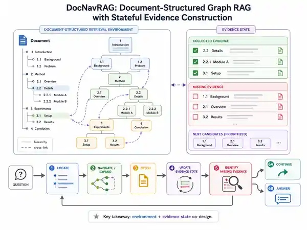

# 🤖 Agentic RAG Radar

**A living research map of Agentic Retrieval-Augmented Generation.**  
Track new papers, understand what actually changed, and see how the field is moving — with skeptical research notes, visual explainers, and weekly/monthly/yearly synthesis.

**Last updated:** 2026-08-12 · [Research compactions](#-research-compactions) · [Latest papers](#-latest-papers) · [Browse by research problem](categories/README.md)

## 🧭 Research Compactions

If you only have a few minutes, **start here**. The archive deliberately becomes coarser with time:

`recent month → weekly` · `recent quarter → monthly` · `all years → yearly`

### Recent Month · Weekly

**[2026-W32 · Convergence, factorization, and a stricter novelty baseline](digests/weekly/2026-W32.md)**  
W32 makes four control variables unusually explicit: **retrieval interface, evidence state, context policy, and retrieval budget**. The revision also corrects an earlier chronology: A-RAG and LLM-Wiki show that agent-facing retrieval-interface design was already explicit before August. The sharper weekly question is now **what modern adaptive control adds after matching the information interface, resource budget, and historical IR/QA prior art**.

[Read the full weekly synthesis →](digests/weekly/2026-W32.md)

### Recent Quarter · Monthly

**[2026-08 · Rolling research map](digests/monthly/2026-08.md)**  
The current month-to-date map is no longer “better retriever → better agent.” It is:

`environment/interface → evidence state → policy/stopping → resource allocation → evaluation`

Three clusters currently survive: **environment/interface design**, **state + resource-aware control**, and **evaluation/novelty discipline**. READ's BM25 result, LLM-Wiki's traversal ablation, Know Before You Fetch's cost accounting, and SAGE's SLO framing pull in complementary directions rather than supporting one simple “agentic wins” story.

[Explore the August map →](digests/monthly/2026-08.md)

### All Years · Yearly

**[2026 · Rolling year-to-date map](digests/yearly/2026.md)**  
The durable 2026 thesis is an explicit **information-acquisition control stack**: what environment the agent sees, what operations it controls, what state it carries, what policy chooses actions, and how much retrieval resource it allocates. A second durable shift is methodological: novelty claims increasingly need a **classical IR/QA baseline**, not only recent RAG comparisons.

[Explore the 2026 year-to-date map →](digests/yearly/2026.md) · [Browse all compactions →](digests/README.md)

<strong>How the time hierarchy works</strong>

**Weekly** preserves local changes and disagreements while they are fresh. **Monthly** compresses several weeks into field-map movement. **Yearly** keeps only durable shifts, defining papers, ideas that weakened, evidence standards, and open problems entering the next year.

Lower-level reports remain in the repository for provenance; they simply age out of the primary reading surface.

## 🚀 Start Here

| If you want to understand… | Read in this order | What you should learn |
|---|---|---|
| **Why retrieval is becoming an environment, not a call** | [A-RAG](papers/2602.03442.md) → [LLM-Wiki](papers/2605.25480.md) → [READ](papers/2608.06305.md) → [DocNavRAG](papers/2608.01565.md) | How the retrieval API/index product becomes part of the research design, and why structure and runtime policy must be separated. |
| **How evidence becomes sequential control** | [Search-o1](papers/2501.05366.md) → [DocNavRAG](papers/2608.01565.md) → [ACE-GraphRAG](papers/2608.01269.md) → [Graph-R1](papers/2507.21892.md) | How observations, explicit evidence state, context policy, stopping, and learned trajectories fit together. |
| **How to reason about retrieval budget and novelty** | [Know Before You Fetch](papers/2606.29959.md) → [SAGE](papers/2608.08237.md) → [Forgotten History or Test-of-Time?](papers/2608.08445.md) | Why calls/tokens/latency are different resources, why adaptive-vs-adaptive baselines matter, and why “iterative retrieval” is not by itself a modern novelty claim. |

<strong>If you only read three papers</strong>

**LLM-Wiki** gives the clearest current environment/interface story and a useful structure-vs-traversal ablation.

**Know Before You Fetch** gives the cleanest systems accounting for adaptive retrieval budget: fewer passages, fewer retrieval calls, and lower latency are not the same claim.

**Forgotten History or Test-of-Time?** recalibrates the novelty baseline: several closed-loop retrieval ideas predate LLMs, so modern work should say what the new model/interface/learning regime actually adds.

Together they force a harder but more useful view of Agentic RAG: **environment + state + policy + resource objective, judged against both strong modern and historical baselines.**

## 🔥 Latest Papers

### [Forgotten History or Test-of-Time? Retrospect and Prospect on RAG from an IR Perspective](papers/2608.08445.md)
`Evaluation & Analysis` · `history` `verification` `query refinement` · **★★★★☆** · 2026-08-09

**AI take:** This is important because it changes **compared with what**. The paper traces iterative query refinement, answer verification, and closed-loop retrieval to classical IR/QA, using QUALIFIER as a concrete precedent. The right conclusion is not “nothing is new”; it is that modern novelty must be located in model capability, interface, scale, state, or learning—not merely the existence of an adaptive loop.

[Paper](https://arxiv.org/abs/2608.08445) · [Research note](papers/2608.08445.md)

<strong>Understand this paper in 60 seconds</strong>

**Problem.** RAG papers often compare only against recent LLM-era systems, which can make old IR/QA ideas look newly invented.

**Core mechanism.** Historical/systematization analysis rather than a new runtime system. QUALIFIER is reconstructed as `structured constraints → retrieve/extract → verify → relax/reformulate → repeat → answer/NIL`.

**Compared with.** LLM-centric histories of RAG and Agentic RAG.

**Evidence to remember.** The paper reports QUALIFIER's TREC 2002 `pris2002` run at **290/500 correct**, second to LCC at **415/500**, and documents repeated successive-constraint relaxation. The claim that this loop explains its competitiveness is retrospective—not a matched causal ablation.

**Open question.** Which modern gains survive when classical closed-loop IR/QA ideas are reimplemented as strong LLM-era baselines?

### [SAGE: SLO-Aware Adaptive Retrieval for Production RAG Systems](papers/2608.08237.md)
`Learning & Optimization` · `budget allocation` `hybrid` `production` · **★★★☆☆** · 2026-08-08

**AI take:** SAGE makes **how much retrieval** a learned per-query action under an explicit latency SLO. That control point is useful; the evidence is narrower than the headline, because the main baseline family is static-k even though adaptive-k and Stop-RAG are relevant prior art.

[Paper](https://arxiv.org/abs/2608.08237) · [Research note](papers/2608.08237.md)

<strong>Understand this paper in 60 seconds</strong>

**Problem.** One global k over-retrieves easy queries and forces a bad quality-versus-tail-latency compromise.

**Core mechanism.** `probe hybrid retrieval → retrieval-side features → learned policy chooses k → top-k context → one LLM generation`; offline budget sweeps provide imitation labels.

**Compared with.** Static-k hybrid RAG, random-k and component ablations; adaptive-k/stopping methods are discussed but not directly benchmarked in the main table.

**Evidence to remember.** On the 334-query NQ table with a 5 s target, SAGE reports **95% SLO compliance / 3.6 s P95 / 22% EM / avg k=9.8**, versus static `k=20` at **30% / 5.6 s / 24% / k=20**.

**Open question.** Does the SLO-aware learned policy still win against strong adaptive budget/stopping controllers on identical retrieval hardware and cost axes?

### [Beyond Top-K: Replacing Black-Box Retrieval with Interpretable Agentic Operations](papers/2608.06305.md)
`Retrieval & Tool Use` · `sparse` `documents` `iterative search` · **★★★★☆** · 2026-08-06

**AI take:** The strongest result is not “agents beat RAG.” It is that an iterative loop cannot rescue a bad retrieval primitive; but **BM25 is statistically indistinguishable from READ**, so the paper is also a warning against over-crediting agentic composition.

[Paper](https://arxiv.org/abs/2608.06305) · [Research note](papers/2608.06305.md)

<strong>Understand this paper in 60 seconds</strong>

**Problem.** Chunk-and-embed retrieval can destroy structural context in table-heavy long documents.

**Core mechanism.** Replace one opaque dense top-k call with **lexical search → structural navigation → bounded read**.

**Agent loop.** `search → navigate → read → inspect → refine → answer`

**Compared with.** Dense top-k RAG, the same iterative loop restricted to top-k, and BM25.

**Evidence to remember.** The abstract reports 58.8% accuracy versus 15.7% dense retrieval and 27.5% for the same loop with top-k; BM25 is reported statistically indistinguishable from READ.

**Open question.** Under matched lexical primitives and retrieval budgets, how much extra value comes from adaptive composition?

### [DocNavRAG: Document-Structured Graph RAG with Stateful Evidence Construction](papers/2608.01565.md)
`Retrieval & Tool Use` · `graph` `documents` `evidence state` · **★★★★☆** · 2026-08-03

**AI take:** The useful abstraction is **environment + evidence-state co-design**: preserve document-native structure as retrieval operations and explicitly track what evidence is collected versus still missing.

[Paper](https://arxiv.org/abs/2608.01565) · [Research note](papers/2608.01565.md)

<strong>Understand this paper in 60 seconds</strong>

**Problem.** Complex document questions need complementary evidence across distant sections/documents; flat retrieval repeatedly reconstructs location from similarity.

**Core mechanism.** Turn hierarchy/cross-region relations into a navigable environment and maintain **collected evidence + missing evidence** state.

**Agent loop.** `locate → navigate/expand → fetch → update evidence state → identify missing evidence → continue or answer`

**Compared with.** Flat passage-level iterative RAG, repeated global semantic search, and fixed-traversal GraphRAG.

**Evidence to remember.** The abstract reports average gains of **7.8% answer quality** and **17.7% context sufficiency** across four long-/multi-document QA benchmarks; structure, state, and budget attribution remain open.

**Open question.** Does explicit evidence state transfer beyond documents to web, SQL, code, or graph-search agents?

### [ACE-GraphRAG: Agentic Context Engineering for Hierarchical GraphRAG](papers/2608.01269.md)
`Iterative Reasoning & Verification` · `graph` `context policy` `multi-hop QA` · **★★★★☆** · 2026-08-02

**AI take:** A rich hierarchy does not guarantee the right context. ACE-GraphRAG makes **context assembly itself a query-dependent policy**; the unresolved question is whether gains survive matched retrieval/token budgets.

[Paper](https://arxiv.org/abs/2608.01269) · [Research note](papers/2608.01269.md)

<strong>Understand this paper in 60 seconds</strong>

**Problem.** Hierarchical GraphRAG can represent useful evidence yet still assemble the wrong context with fixed rules.

**Core mechanism.** Detect a context gap and choose complementary **depth-oriented factual** versus **breadth-oriented semantic** retrieval branches.

**Agent loop.** `build context → detect gap → choose branch → retrieve → consolidate → adapt → generate`

**Compared with.** Hierarchical GraphRAG with fixed/predetermined context construction.

**Evidence to remember.** The paper reports gains on HotpotQA, 2WikiMultiHopQA, and UltraDomain subsets; exact attribution to the adaptive policy versus extra context budget still needs stronger checking.

**Open question.** Is the policy better, or does the system simply spend more retrieval/context budget through multiple branches?

## ⭐ Design Anchors

| Work | Why it is a useful design point |
|---|---|
| **[A-RAG](papers/2602.03442.md)** | Makes keyword search, semantic search, and chunk read an explicit model-controlled retrieval interface. |
| **[LLM-Wiki](papers/2605.25480.md)** | Makes the index product itself an agent-facing linked environment and ablates progressive traversal against the same structure. |
| **[Know Before You Fetch](papers/2606.29959.md)** | Makes retrieval amount a graded decision and separates calls, context volume, and real latency. |
| **[Search-o1](papers/2501.05366.md)** | Moves search inside the reasoning trajectory. |
| **[Graph-R1](papers/2507.21892.md)** | Learns multi-turn graph retrieval/reasoning trajectories with RL. |
| **[Agentic-R](papers/2601.11888.md)** | Trains retrieval for trajectory-level downstream utility rather than static relevance. |

<strong>How these anchors fit together</strong>

One useful progression is:

`plan/reason about information need → expose an operation environment → represent evidence progress → allocate retrieval budget → learn the policy → evaluate causally`

The current 2026 map is therefore broader than “agent + retriever.” It increasingly looks like **environment × state × policy × resources**, with an additional historical question: which control ideas are new versus newly scalable/learnable with LLMs?

[See the full anchor notes →](papers/anchors.md)

## 🗂 Browse by Research Problem

| Research problem | Question |
|---|---|
| **[Planning & Query Formulation](categories/planning-query-formulation.md)** | What should be retrieved next, and how is the information need decomposed or reformulated? |
| **[Retrieval & Tool Use](categories/retrieval-tool-use.md)** | Which information operations—and how much retrieval resource—should the agent control? |
| **[Iterative Reasoning & Verification](categories/iterative-reasoning-verification.md)** | How does new evidence change retrieval, verification, and stopping? |
| **[Multi-Agent & Orchestration](categories/multi-agent-orchestration.md)** | When does specialization/coordination justify multiple retrieval agents? |
| **[Learning & Optimization](categories/learning-optimization.md)** | What should be learned once retrieval is a trajectory or resource-allocation action space? |
| **[Evaluation & Analysis](categories/evaluation-analysis.md)** | How do we isolate agentic control from stronger tools, budgets, models, or rediscovered prior art? |

<strong>Planning & Query Formulation — plan first, or react to evidence?</strong>

**Current anchor.** [PlanRAG](papers/2406.12430.md).

**Strongest signal.** Explicit planning gives retrieval a stable upstream objective, but evidence-state systems suggest the next step can instead be selected directly from what remains missing.

**Biggest unresolved question.** When does a precommitted plan beat online replanning after failed or contradictory retrieval?

**Next decisive evidence.** Plan-repair/decomposition experiments under matched resource budgets and structured targets such as SQL, graphs, web, or code.

<strong>Retrieval & Tool Use — what should the agent actually be allowed to do?</strong>

**Current anchors.** [A-RAG](papers/2602.03442.md), [LLM-Wiki](papers/2605.25480.md), [READ](papers/2608.06305.md), [DocNavRAG](papers/2608.01565.md), and [Know Before You Fetch](papers/2606.29959.md).

**Strongest signal.** The design target is becoming a **minimal sufficient retrieval API with explicit resource semantics**: search/read/navigation plus a clear meaning for calls, context volume, and budget.

**Biggest unresolved question.** How much capability comes from the richer environment, how much from adaptive policy, and how much from resource allocation?

**Next decisive evidence.** Same-substrate operation ablations, fixed-vs-agentic control using identical tools, and adaptive-vs-adaptive budget comparisons with calls/tokens/latency matched.

<strong>Iterative Reasoning & Verification — what state should drive the next retrieval?</strong>

**Current anchors.** [Search-o1](papers/2501.05366.md) and [ACE-GraphRAG](papers/2608.01269.md), with DocNavRAG adding explicit evidence state.

**Strongest signal.** “Iterative” is too weak a description. The important design object is the **state** that represents progress, gaps, uncertainty, and stopping conditions.

**Biggest unresolved question.** Does explicit evidence state outperform a strong controller using raw reasoning/history once resource budgets are matched?

**Next decisive evidence.** Explicit-state vs raw-history ablations, adaptive vs fixed stopping at equal budgets, and conflicting/adversarial-evidence tests.

<strong>Multi-Agent & Orchestration — is another agent worth the coordination cost?</strong>

**Current status.** No paper currently clears the radar's precision threshold as a primary multi-agent retrieval contribution. The empty category is intentional.

**Strongest signal.** Parallel LLM calls are not enough; specialization, evidence coordination, conflict resolution, or adaptive budget allocation must be the research delta.

**Biggest unresolved question.** Does orchestration beat a strong single-agent controller at comparable total model/retrieval budget?

**Next decisive evidence.** Matched-budget many-vs-one comparisons with genuinely different tools/corpora/objectives and explicit coordination analysis.

<strong>Learning & Optimization — what should be learned?</strong>

**Current anchors.** [Agentic-R](papers/2601.11888.md), [Graph-R1](papers/2507.21892.md), and [SAGE](papers/2608.08237.md).

**Strongest signal.** Learning objectives are expanding from local relevance to **trajectory utility and resource allocation**.

**Biggest unresolved question.** Did the learned policy improve decisions, or merely discover a better average compute allocation than a weak controller/static baseline?

**Next decisive evidence.** Learned-vs-strong-adaptive controllers on the same interface, intermediate-action/resource credit assignment, transfer under workload drift, and stability/sample-efficiency analysis.

<strong>Evaluation & Analysis — how do we know the “agentic” part or the “new” part caused the gain?</strong>

**Current anchors.** [Forgotten History or Test-of-Time?](papers/2608.08445.md) and [Agentic RAG SoK](papers/2603.07379.md).

**Strongest signal.** A system score is not enough when papers simultaneously change **substrate × operation set × state × policy × budget × base model**—and a novelty claim is not enough when the same control pattern has classical IR/QA antecedents.

**Biggest unresolved question.** Can we measure policy/trajectory quality independently of better tools/resources while also identifying what LLM-era capability is genuinely new?

**Next decisive evidence.** Matched-budget trajectory benchmarks, explicit failure labels, diverse workloads beyond document QA, quality-cost frontiers, and modern implementations of strong historical baselines where relevant.

[Explore the full research map →](categories/README.md)

## 🖼️ How to Read a Paper Here

- **30-second scan:** title, category, importance, date, and skeptical AI take.
- **60-second expand:** visual when verified, then problem, mechanism, control flow, closest comparison, strongest evidence, and one open question.
- **Deep dive:** open the research note for detailed evidence, limitations, provenance, and visual grounding.

## What Counts as Agentic RAG?

A work is included when **external retrieval/search/context acquisition is substantive and an agent, controller, or learned policy materially changes whether, what, where, how, or how many times information is acquired**.

Ordinary fixed `retrieve top-k → generate` pipelines are not included merely because they use an LLM. Generic agents are excluded when retrieval is incidental. Pure retriever/reranker/index work is excluded unless adaptive information-access control is itself part of the research contribution.

## About the Radar

This is a **curated research map, not an exhaustive keyword feed**. Every included work should help answer:

1. **What actually changed?**
2. **Compared with what—including older prior art?**
3. **Does the evidence isolate the claimed cause?**

Negative results are kept when they change the interpretation of a paper.

## 🤝 Contributing

Corrections are especially welcome when they change the conclusion: a missing baseline, unfair resource budget, wrong taxonomy, overclaimed novelty, broken provenance, or a visual that implies a mechanism the evidence does not support.

<strong>Methodology & maintenance</strong>

See the [maintainer guide](docs/MAINTENANCE.md), [curation protocol](CURATION.md), [compaction protocol](COMPACTION.md), [visual grounding rules](VISUALS.md), [taxonomy](taxonomy.yaml), and [structured paper records](data/papers/).

---

If this radar saves you research time, consider starring the repo.
