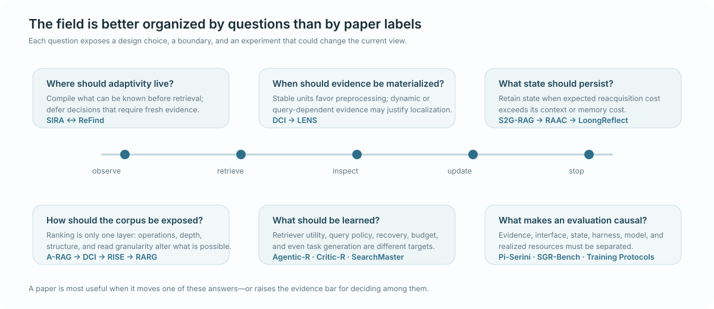

# Research Map

[Latest Papers](../README.md#latest-papers) · [What's Changing](../README.md#whats-changing) · [Reading Paths](../README.md#reading-paths) · [Curated Paper Index](../papers/README.md)

  

The field is more useful to reason about as a set of **live research questions** than as a taxonomy of method names. Each question below has a current answer, a boundary where that answer weakens, and an experiment that could change the map.

## Live Research Questions

###  Where should adaptivity live?

**Current view.** Some control can be compiled before evidence is read when the system exposes useful corpus-visible statistics or structure. Other control is irreducibly result-conditioned because the next query depends on names, constraints, or relationships discovered only after retrieval.

**Key design points.** [SIRA](../papers/2605.06647.md) ↔ [ReFind](../papers/2608.12888.md), with [PlanRAG](../papers/2406.12430.md) as an explicit-planning predecessor.

**Boundary.** SIRA pays offline corpus-side intelligence and does not dominate multi-round search at every model/budget; ReFind has a task where single-shot BM25 slightly wins.

**What would change our mind.** A same-substrate, same-model, same-total-compute experiment comparing pre-retrieval compilation, one-shot retrieval, and result-conditioned replanning while controlling what corpus information each controller can observe.

---

###  When should evidence be materialized?

**Current view.** Stable corpora and predictable evidence units favor preprocessing. Dynamic corpora or query-dependent evidence granularity can justify preserving raw data and localizing evidence only after the information need is known.

**Key design points.** [DCI](../papers/2605.05242.md) → [RISE](../papers/2606.06880.md) / [DR-DCI](../papers/2606.14885.md) → [LENS](../papers/2608.16185.md).

**Boundary.** “No index” is not “no cost”: raw interaction can scale poorly, and LENS spends more online work while failing to beat ReAct on the main answer-EM comparison.

**What would change our mind.** Same changing corpus, same answer/evidence target, and lifecycle-matched offline construction/update + online localization/search cost across indexed, bounded-interaction, and latent-localization designs.

---

###  What state should persist?

**Current view.** Agent state has several owners: external source configuration, accumulated evidence/gaps, trajectory progress, active reasoning state, and retained context. The value of state depends on **future reuse × recoverability × reacquisition cost**, not size alone.

**Key design points.** [SGR-Bench](../papers/2605.22219.md) → [S2G-RAG](../papers/2604.23783.md) → [RAAC](../papers/2608.15191.md) → [LoongReflect](../papers/2608.11967.md) → [Context Compression Cost](../papers/2608.16370.md).

**Boundary.** More explicit state can simply add controller capacity or privileged supervision; compression does not create a retrieval tax in every environment.

**What would change our mind.** Counterfactual restoration or deletion of individual state classes with matched context, tool, controller, latency, and answer-quality accounting.

---

###  How should retrieval expose the corpus?

**Current view.** “Retriever quality” is too coarse. Candidate admissibility, ranking, surfaced depth, local operations, structural navigation, result inspection, and reading granularity can independently determine what the agent is able to find and verify.

**Key design points.** [A-RAG](../papers/2602.03442.md) → [DCI](../papers/2605.05242.md) → [RISE](../papers/2606.06880.md) → [RARG](../papers/2607.24223.md), with [Pi-Serini](../papers/2605.10848.md) and [SIEVE](../papers/2608.02751.md) providing strong factorization evidence.

**Boundary.** Richer interfaces can cost more, and lexical/direct interaction remains brittle to semantic mismatch. A weak harness can also make the same retrieval primitive appear worse.

**What would change our mind.** Factorial backend × surfaced-depth × operation-set × read-resolution experiments with the same model, evidence pool, and realized budget.

---

###  What should be learned?

**Current view.** “Learn the retrieval policy” hides several distinct objects: retriever utility, query/refinement policy, direct-corpus operation policy, recovery behavior, resource allocation, and even the distribution of training tasks and trajectories.

**Key design points.** [Agentic-R](../papers/2601.11888.md), [Critic-R](../papers/2606.00590.md), [GrepSeek](../papers/2605.29307.md), [SearchMaster](../papers/2608.01822.md), [LoongReflect](../papers/2608.11967.md).

**Boundary.** A richer interface, privileged teacher/verifier, different evidence coverage, easier self-play curriculum, or larger realized budget can masquerade as a better learning objective.

**What would change our mind.** Same environment/state/action space/base model while varying learned component, reward/credit assignment, teacher information, and task-generation policy independently.

---

###  What makes an evaluation causal?

**Current view.** Attribution can already fail before the controller acts. The evidence must exist; the backend must expose it; the agent must be able to inspect it; the source and internal state must be correct; the harness must preserve it; and total realized resources must be matched before a policy receives credit.

**Key design points.** [Training Protocols](../papers/2605.27881.md) → [Pi-Serini](../papers/2605.10848.md) → [SGR-Bench](../papers/2605.22219.md) → [Is Grep All You Need?](../papers/2605.15184.md) → [VAKRA](../papers/2608.12282.md).

**Boundary.** Final-answer success can hide upstream failure or extra work; even “same retriever” is not the same experiment when surfaced depth, delivery path, retained state, or controller cost differs.

**What would change our mind.** An executable benchmark that can replay the same task while independently swapping backend, interface, source state, retained state, harness, and controller—and counterfactually repair one intermediate failure.

## Cross-Cutting Causal Lens

For system claims, the radar reasons over:

`substrate/evidence coverage × pre-retrieval corpus observability × corpus boundary/interface resolution × environment retrieval state × harness/delivery × agent state/retention × policy × realized resources × base model × training distribution/protocol × historical baseline`

The current systems tension is:

> **precompute / materialize / retain ↔ defer / localize / reacquire**

Removing an index, search call, or prompt token is only an efficiency win if the displaced work does not reappear elsewhere at the same answer/evidence quality.

## Browse by Canonical Category

The categories below are still useful for ownership, indexing, and focused reading. They are secondary to the live research questions above.

| Category | Core question | Current signal |
|---|---|---|
| [Planning & Query Formulation](planning-query-formulation.md) | What can be decided before evidence, and what should be replanned after observing it? | PlanRAG and SIRA make pre-retrieval control explicit. |
| [Retrieval & Tool Use](retrieval-tool-use.md) | What information-access operations and evidence resolution should the agent control? | Interface resolution and materialization placement are now first-class design axes. |
| [Iterative Reasoning & Verification](iterative-reasoning-verification.md) | What state should drive continue, redirect, recovery, verification, or stopping? | Sufficiency, progress, and reversible state are separating into distinct control variables. |
| [Multi-Agent & Orchestration](multi-agent-orchestration.md) | When does specialization justify coordination cost? | No current paper clears the radar's precision threshold as a primary retrieval-orchestration contribution. |
| [Learning & Optimization](learning-optimization.md) | Which part of the information-acquisition loop should be learned? | Learning targets now include retrievers, control, recovery, budgets, and self-play task distributions. |
| [Evaluation & Analysis](evaluation-analysis.md) | How do we isolate what actually caused a gain? | Evidence availability, interface, state, harness, and resources repeatedly overturn coarse conclusions. |

Orthogonal tags in [`../taxonomy.yaml`](../taxonomy.yaml) capture substrate, modality, control pattern, training paradigm, and task/domain. Category pages are living research memos: they should change when evidence changes, not simply accumulate links.
