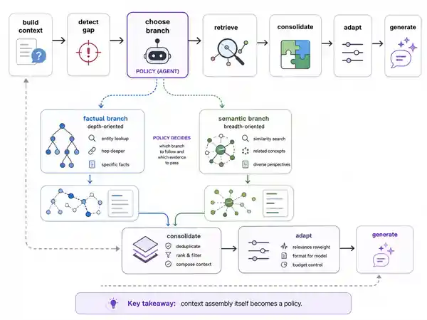

# ACE-GraphRAG: Agentic Context Engineering for Hierarchical GraphRAG

**arXiv:** [2608.01269](https://arxiv.org/abs/2608.01269) · **Published:** 2026-08-02 · **Category:** Iterative Reasoning & Verification · **Importance:** 4/5 · **AI confidence:** Medium

**Tags:** `graph` `knowledge graph` `routing` `iterative search` `multi-hop QA`

> **TL;DR.** ACE-GraphRAG separates **what a hierarchical graph represents** from **how context is assembled for a query**, turning context construction into an adaptive inference-time policy over complementary retrieval branches.

## Visual explainer

*AI-generated conceptual explainer based on the radar's abstract-grounded interpretation; not a reproduction of the paper's original figure.*

**How to read this figure.** Treat the graph/hierarchy as the **substrate that already exists** and the decision layer above it as the contribution to focus on. A detected context gap selects a depth-oriented factual branch or a breadth-oriented semantic branch; the resulting evidence is consolidated and can trigger another policy decision before generation.

**Compared with.** Fixed-context hierarchical GraphRAG and non-adaptive context assembly.

**Do not over-read.** The diagram separates representation from context policy conceptually; it does not establish that the adaptive policy alone causes the reported gains. Retrieval/context budget and graph-construction quality remain plausible alternative explanations until matched ablations are checked.

**Grounding.** Abstract-grounded first pass; full-paper budget and ablation verification pending.

## Problem

A GraphRAG system can build a rich multi-resolution representation and still feed the wrong context to the model. Representation quality and inference-time context selection are different problems.

## Core idea

Add a context-policy layer that detects missing context, invokes complementary retrieval branches, consolidates evidence with provenance, and adapts context construction to the query and graph topology.

## Agent loop

`Build initial context → detect gap → choose depth/breadth branch → retrieve → consolidate → adapt → generate`

## Retrieval design

The paper describes **Parallel Differential Retrieval** that separates depth-oriented factual evidence from breadth-oriented semantic evidence, plus an adaptive variant that selects context policies based on task/query and graph topology.

## Compared to what

The nearest design point is hierarchical GraphRAG with fixed or largely predetermined context construction. The research delta is not another graph representation; it is treating **context selection over the representation as a policy**.

## Evidence

The abstract reports evaluation on **HotpotQA, 2WikiMultiHopQA, and four UltraDomain subsets**, with Full-ACE outperforming evaluated RAG/GraphRAG baselines and Adaptive-ACE improving further in reported settings. Exact effect sizes, cost, and component ablations remain to be checked.

## Why it matters

This exposes a useful representation–inference separation. Once a retrieval substrate becomes rich—hierarchical documents, graph communities, SQL schemas, multimodal indexes—the system still needs a policy that decides which part of that structure should reach the model under a finite budget.

That makes **context engineering a sequential systems problem**, not merely a post-processing step after retrieval.

## Limitations / questions

- Are gains preserved under matched retrieved-token, retrieval-call, and latency budgets?
- How much improvement comes from the two complementary branches versus adaptive policy selection?
- How sensitive is the policy to graph construction quality and topology?
- Is the policy abstraction transferable to non-graph retrieval substrates?

**Curator take:** **4/5**. The representation–policy separation is clean and likely reusable, but attribution to the adaptive policy remains provisional until budget-matched full-paper evidence is checked.
