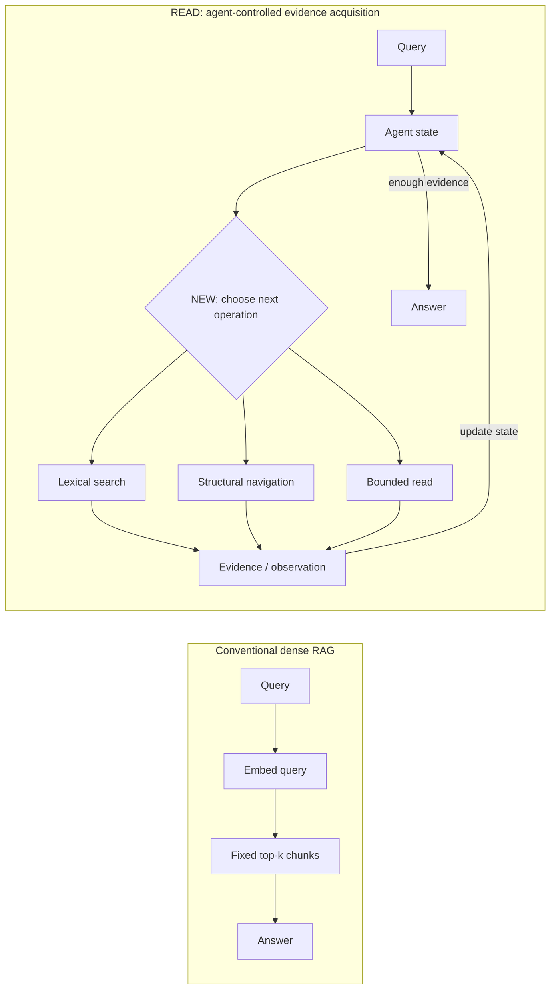

# Beyond Top-K: Replacing Black-Box Retrieval with Interpretable Agentic Operations

> **Category:** `Retrieval & Tool Use` · **Importance:** 4/5 · **AI confidence:** medium  
> **Grounding:** abstract/metadata checked; full-paper verification pending

[Paper](https://arxiv.org/abs/2608.06305) · [PDF](https://arxiv.org/pdf/2608.06305)

## Visual Explainer

> AI-generated conceptual explainer; not a reproduction of the paper's figure.

**What to notice.** The main change is the **retrieval interface**: one opaque top-k call becomes explicit search / navigation / read operations whose observations drive the next decision.

**Compared with.** Dense top-k RAG and an agent using the same iterative loop with only a top-k retrieval tool. The abstract also reports BM25 as statistically indistinguishable from READ, so this is not evidence that agentic composition itself is always necessary.

## TL;DR

READ replaces opaque top-k embedding retrieval with replayable lexical search, structural navigation, and bounded reads so the agent can control evidence acquisition through an interpretable interface.

## Research Read

**Problem.** Chunk-and-embed retrieval can lose structural context in table-heavy long documents, where values depend on distant headers, units, and layout.

**Core idea.** Expose deterministic document operations and let an agent compose them into an auditable retrieval trajectory.

**Agent loop.** `Search → navigate → bounded read → inspect → refine → answer`

**Compared to what.** Dense top-k retrieval, table-aware chunking, the same agent loop with a top-k tool, and BM25.

**Evidence.** The abstract reports 58.8% accuracy on 51 verified questions versus 15.7% for dense retrieval and 27.5% for an agent using the same loop with a top-k tool. It also reports BM25 as statistically indistinguishable from READ.

**Why it matters.** The informative result is the interface ablation: iteration alone may not rescue a poor retrieval primitive. The BM25 result is equally important because it prevents an over-broad “agent beats non-agent” conclusion.

**Limitations / questions.** Small evaluation; one table-heavy government report; full-paper verification still pending; unclear whether a strong non-agentic lexical pipeline captures most of the benefit.
