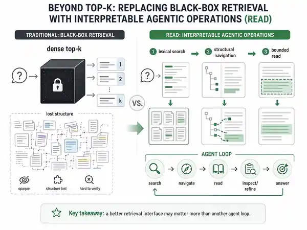

# Beyond Top-K: Replacing Black-Box Retrieval with Interpretable Agentic Operations

**arXiv:** [2608.06305](https://arxiv.org/abs/2608.06305) · **Published:** 2026-08-06 · **Category:** Retrieval & Tool Use · **Importance:** 4/5 · **AI confidence:** Medium

**Tags:** `sparse` `documents` `tool selection` `iterative search` `planning`

> **TL;DR.** READ replaces opaque top-k embedding retrieval with replayable lexical search, structural navigation, and bounded reads so the agent can control evidence acquisition through an interpretable retrieval interface.

## Visual explainer

*AI-generated conceptual explainer based on the radar's abstract-grounded interpretation; not a reproduction of the paper's original figure.*

**How to read this figure.** Read left-to-right as a change in the **retrieval control surface**, not merely a longer reasoning chain. The muted side compresses evidence access into one top-k call; the agentic side exposes search, navigation, and bounded reading as separate observations/actions that can change the next acquisition step.

**Compared with.** Dense top-k RAG and the same iterative agent loop with only a top-k retrieval tool.

**Do not over-read.** The figure does **not** establish that agentic composition itself is necessary: the reported BM25 baseline is statistically indistinguishable from READ, so the strongest supported claim is about the retrieval primitive/interface for this workload.

**Grounding.** Abstract-grounded first pass; full-paper verification pending.

## Problem

Chunk-and-embed retrieval can lose structural context in table-heavy long documents, where values depend on distant headers, units, and layout. Giving an agent the ability to repeatedly call the same dense top-k interface does not necessarily repair that information loss.

## Core idea

Expose deterministic document operations—lexical search, structural navigation, and bounded reads—and let an agent compose them into a replayable evidence-acquisition trajectory.

## Agent loop

`Lexical search → navigate structure → bounded read → inspect → refine → answer`

## Retrieval design

The interface is operation-oriented rather than embedding-oriented. Search locates candidate regions, navigation moves through structure, and bounded reads expose controlled evidence spans. Observations can then change the next operation.

## Compared to what

Dense top-k retrieval, table-aware chunking, the same iterative agent loop constrained to a top-k tool, and BM25.

## Evidence

The abstract reports **58.8% accuracy on 51 verified questions**, versus **15.7% for dense retrieval** and **27.5% for an agent using the same loop with a top-k tool**. Crucially, it also reports **BM25 as statistically indistinguishable from READ**.

## Why it matters

The strongest research result is the interface ablation: **iteration alone may not rescue a poor retrieval primitive**. The BM25 result is equally important because it weakens a broad “agent beats non-agent” interpretation and suggests the real gain may be lexical/structural access for this workload.

That is a more useful conclusion for system design than another headline Agentic RAG win.

## Limitations / questions

- The reported evaluation is small and centered on one table-heavy government financial report.
- The current evidence does not establish that agentic composition is necessary versus a strong non-agentic lexical pipeline.
- Full-paper verification is still pending.
- The next decisive experiment is primitive-matched: same lexical/navigation tools under fixed versus adaptive policies, with matched call/token budgets.

**Curator take:** **4/5**. Important less for the final score than for exposing a confound the field should test explicitly: retrieval-interface quality versus agent-policy quality.
