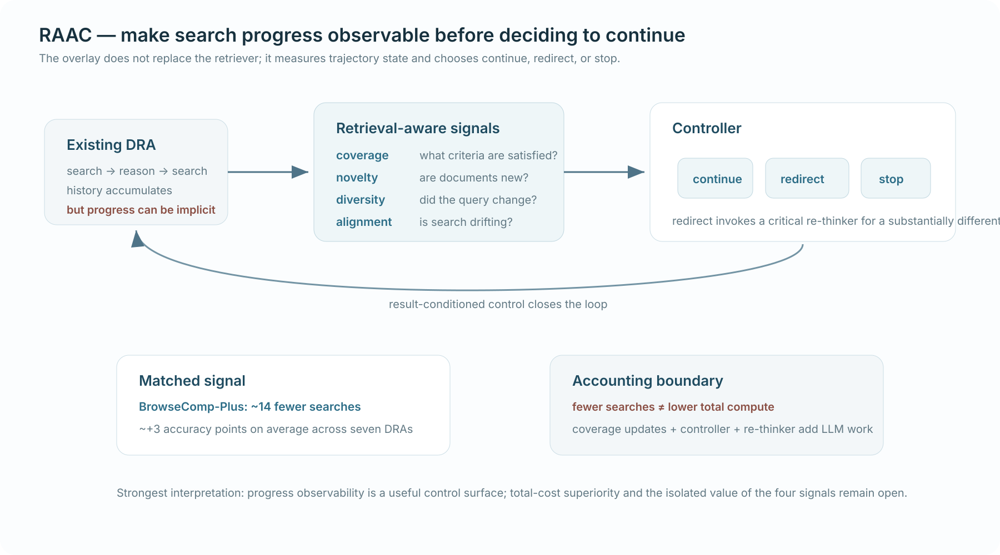

# When Deep Research Agents Stagnate: Enhancing Reasoning with Retrieval-Aware Agent Control

*Published 15 Aug 2026 · Iterative Reasoning & Verification · Importance 4/5 · Full-text reviewed · Confidence high*

[Paper](https://arxiv.org/abs/2608.15191)

> **TL;DR.** RAAC treats deep-research stagnation as a trajectory-control problem: retrieval-aware progress signals summarize coverage, novelty, query diversity, and drift, then an overlay controller decides to continue, redirect, or stop. Same-agent comparisons are a strong part of the paper; the unresolved systems issue is whether fewer searches survive full accounting for controller and re-thinker compute.

| 30-second verdict | |
|---|---|
| **Why this paper matters** | It makes **progress observability** a first-class state variable for long-running search. |
| **Strongest evidence** | On BrowseComp-Plus, RAAC reports roughly **14 fewer searches** and about **+3 accuracy points on average** across seven DRA families. |
| **Biggest caveat** | Search-call savings omit coverage-update/controller/re-thinker LLM work, and several agent/dataset cells get worse. |

  

**How to read this figure.** RAAC sits above an existing deep-research agent. It measures four trajectory properties, passes them to a controller, and only then decides whether the underlying agent should continue, be redirected through a critical re-thinker, or stop.

**Compared with.** The same seven DRA families without the overlay, which is more informative than comparing a new end-to-end system against unrelated baselines.

**Do not over-read.** Fewer search actions do not establish lower end-to-end cost because the overlay itself spends model compute.

## Research question

What information should a long-horizon search controller observe in order to know that **search has saturated, drifted, or become repetitive**?

Many deep-research agents already possess the entire text history. The paper argues that raw history is not the same thing as a useful **progress state**: the controller needs explicit signals about what requirements are covered, whether the evidence is new, whether the query is changing, and whether search is still aligned with the task.

## Research delta

RAAC introduces a compact, model-agnostic progress layer with four signals:

- **criteria coverage** — which information requirements appear satisfied;
- **document novelty** — whether the current retrieval adds unseen evidence;
- **query diversity** — whether successive searches are actually changing direction;
- **query-to-question alignment** — whether the trajectory is drifting from the task.

The controller then chooses `continue`, `intervene`, or `stop`. `Intervene` is stronger than ordinary stopping: it invokes a critical re-thinker that diagnoses the stagnation pattern and produces a substantially different query.

The smallest research delta is therefore not “adaptive stopping.” It is **progress-aware trajectory control with an explicit redirect action**.

## Mechanism

**Control flow.** `search/reason → update coverage + novelty + diversity + alignment → controller chooses continue | intervene | stop → redirected query if needed → retrieve → repeat or answer`

The overlay architecture matters experimentally because it can be attached to multiple existing DRAs without replacing their retriever or core search loop. That creates a useful factorization:

`underlying DRA + same retrieval pipeline + optional RAAC overlay`

instead of comparing two systems that differ everywhere.

The most debatable component is `intervene`. It bundles two things:

1. the progress signals indicate that something is wrong;
2. an extra model is given compute to diagnose the trajectory and synthesize a new direction.

That means the paper isolates the **overlay package** better than it isolates the value of the signals alone.

## Evidence & attribution

| Claim | Evidence | Closest control | Assessment |
|---|---|---|---|
| Long search trajectories visibly stagnate | Intermediate recall/accuracy plateaus while repeated-document retrieval grows | Native DRA trajectories | **Well supported** as a diagnostic pattern |
| RAAC improves the same underlying agents | ~**14 fewer searches** and ~**+3 accuracy points** on average on BrowseComp-Plus | Same seven DRAs without RAAC | **Strong system-level support** |
| Progress signals themselves cause the gain | `Intervene` also adds a critical re-thinker and extra compute | No simple signal-only matched control | **Partly identified** |
| RAAC reduces total cost | Search-call count falls, but overlay LLM work is not charged in that metric | Same DRA without overlay | **Unproven** |
| The overlay helps universally | Several rows increase calls or lose recall | Cross-agent/dataset cells | **Rejected as a universal claim** |

The strongest part of the evidence is the **same-agent overlay comparison**. It is much cleaner than introducing a new architecture, new retriever, and new base model at once.

The main confound is resource substitution. RAAC can spend more controller/re-thinker computation to avoid some retrieval. That may still be a good trade, but the paper's search-call metric alone cannot tell us.

A second observability confound is dataset-specific criteria. BrowseComp-Plus provides explicit criteria; NeuCLIR and LegalSearch require LLM-generated/updated criteria. The state seen by the controller is therefore not identical across datasets.

## Where it fits

A useful state-control lineage is:

`S2G-RAG → RAAC → LoongReflect`

- **S2G-RAG:** asks whether current evidence is sufficient and explicitly represents what is missing.
- **RAAC:** asks whether the **trajectory itself** is still making progress and adds redirect/stop control.
- **LoongReflect:** goes beyond redirect by making active reasoning state reversible through rollback.

This suggests that “agent history” is splitting into several control objects:

`evidence sufficiency ≠ progress/stagnation ≠ trusted/contaminated branch state`.

That separation is more durable than the generic claim that long-horizon agents need “better memory.”

## Open question

The decisive experiment is a matched-cost decomposition:

> same DRA + same retrieval/history representation, comparing stopping-only, progress signals without re-thinker, redirect with fixed extra compute, and full RAAC—while charging **all** controller + retrieval tokens, calls, and latency.

That would tell us whether the key gain comes from better observability, from the redirect action space, or simply from spending extra reasoning compute at moments of stagnation.
