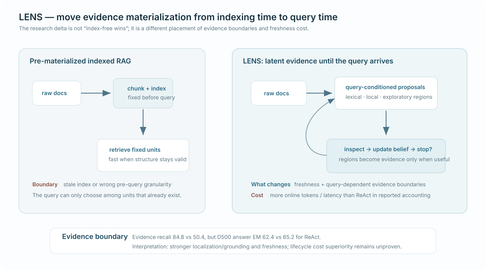

# LENS: In-Context Search via Latent Evidence Exploration over Dynamic Raw Documents

*Published 17 Aug 2026 · Retrieval & Tool Use · Importance 4/5 · Full-text reviewed · Confidence high*

[Paper](https://arxiv.org/abs/2608.16185)

> **TL;DR.** LENS moves evidence materialization from indexing time to query time. Raw-document regions remain latent until the query arrives, then a budgeted controller proposes, inspects, and refines regions. The strongest result is better evidence localization/grounding and freshness—not better answer EM than ReAct—and the price is more online work.

| 30-second verdict | |
|---|---|
| **Why this paper matters** | It makes **when evidence becomes a retrieval unit** a first-class systems decision. |
| **Strongest evidence** | D500 evidence recall is **84.8% vs 50.4%** for ReAct-style raw search; stale-index experiments expose the freshness advantage. |
| **Biggest caveat** | ReAct is better on D500 answer EM (**65.2 vs 62.4**), fullwiki answer EM is nearly tied, and LENS spends more online tokens/latency. |

  

**How to read this figure.** The left side fixes evidence units before the query through chunking/indexing; the right side keeps the raw corpus intact and creates useful regions only after the query reveals what granularity and evidence are needed. The bottom band is the important interpretation: LENS changes the placement of freshness and localization work rather than removing cost.

**Compared with.** Fresh/stale indexed RAG and matched index-free ReAct-style search over the same raw corpus snapshot.

**Do not over-read.** The figure does not imply that query-time localization is universally cheaper or more accurate; the paper's main controlled answer metric does not support that claim.

## Research question

When a corpus is changing, or when the right evidence granularity cannot be known before the question arrives, **should the system materialize chunks/index entries ahead of time or leave evidence boundaries latent until query time?**

This is earlier than the usual “one search or many?” question. Even before deciding how often to retrieve, the system has already chosen whether a future query must search among **pre-existing evidence units** or can define evidence regions online.

## Research delta

The smallest useful delta is **Budgeted Evidence Localization over raw documents**.

LENS does not merely replace dense retrieval with another search primitive. It moves the construction of evidence regions into the query-time control loop. A low-cost prior proposes lexical/local/structural candidates; an LLM relevance oracle inspects raw text, updates per-fact beliefs and proposal weights, and stops when the evidence requirements are resolved or the budget is exhausted.

The important design axis becomes:

`pre-materialized evidence units ↔ query-conditioned evidence regions`

rather than `indexed RAG ↔ agentic RAG` in the abstract.

## Mechanism

**Control flow.** `build query-conditioned prior → propose raw-document regions → inspect with relevance oracle → update beliefs/proposal mix → continue or stop under budget → consolidate grounded evidence → answer`

Three pieces matter conceptually:

1. **Latent evidence space.** Candidate evidence boundaries do not need to be committed during preprocessing.
2. **Sequential exploration.** Each relevance observation changes where the next region should come from.
3. **Budgeted stopping.** The controller trades additional inspection against unresolved evidence needs rather than scanning the raw corpus unconstrained.

This is not equivalent to ordinary direct corpus interaction. DCI exposes raw files and operations; LENS additionally treats **which raw region should count as evidence** as an online inference problem.

## Evidence & attribution

| Claim | Evidence | Closest control | Assessment |
|---|---|---|---|
| Query-time localization improves evidence coverage | **84.8% vs 50.4% evidence recall** on D500 | ReAct-style raw-corpus search | **Strongly supported** in the reported setting |
| LENS improves answer quality | **62.4% vs 65.2% EM** on D500; **43.3% vs 42.7%** on fullwiki | Same ReAct-style control | **Not supported as a general claim** |
| Sequential exploration is load-bearing | Removing sequential exploration materially hurts the reported fullwiki result | LENS ablation | **Supported** |
| Every proposal heuristic is necessary | Removing the multi-signal prior does not reduce EM in the reported fullwiki ablation | LENS ablation | **Weakened** |
| Zero indexing means lower system cost | LENS uses more online tokens/latency in the controlled accounting | ReAct + indexed baselines | **Unproven without lifecycle matching** |

The most informative result is therefore a **metric split**: evidence localization gets much better while answer EM does not. That prevents a lazy “index-free beats RAG” interpretation and instead points to grounding/freshness as the real value proposition.

A second attribution issue is parametric knowledge. The closed-book reference remains substantial on fullwiki, so final answer correctness does not isolate external evidence quality as cleanly as evidence recall/grounding does.

## Where it fits

A useful lineage is:

`SIRA → ReFind → LENS`

- **SIRA:** move more intelligence **before retrieval** by compiling a corpus-aware lexical action from model priors + corpus statistics.
- **ReFind:** preserve raw conversational history and let **result-conditioned question-time control** exploit session/time/local cues.
- **LENS:** move an even earlier decision online by making **evidence boundaries themselves query-conditioned** over dynamic raw documents.

This suggests two independent placement questions:

1. **Where does adaptivity live?** before evidence vs after observing evidence.
2. **When does evidence materialize?** before the query vs during query-time localization.

LENS matters because it makes the second axis concrete.

## Open question

The decisive experiment is a **lifecycle-matched changing-corpus comparison**:

> same raw corpus + same update stream + same model + matched answer/evidence quality + equal total offline construction/update and online controller/retrieval compute, comparing fresh indexing, bounded direct interaction, and latent query-time localization.

Without that experiment, LENS establishes a strong new design point for freshness and evidence fidelity, but not the globally optimal placement of work.
