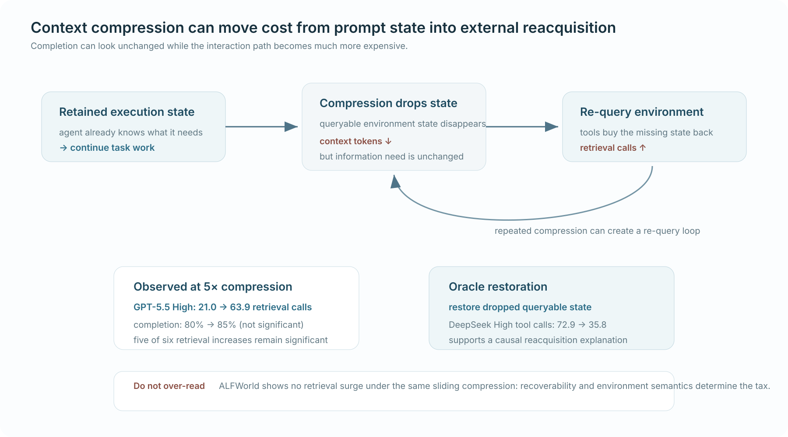

# What Does Context Compression Cost an Agent? Interaction Costs Unrevealed by Task-Completion Metrics

*Published 17 Aug 2026 · Evaluation & Analysis · Importance 4/5 · Full-text reviewed · Confidence high*

[Paper](https://arxiv.org/abs/2608.16370)

> **TL;DR.** Context compression can leave task completion statistically unchanged while forcing an agent to spend far more interaction budget re-querying external state. Oracle restoration of the dropped queryable state removes most of the extra retrieval, so completion-only evaluation can hide a real **reacquisition tax**.

| 30-second verdict | |
|---|---|
| **Why this paper matters** | It turns state retention from a context-size question into a **systems cost-allocation** question. |
| **Strongest evidence** | At `5×`, retrieval rises in all six model-regime cells while completion does not significantly change; GPT-5.5 High goes **21.0 → 63.9 retrieval calls**. |
| **Biggest caveat** | The effect is environment-dependent: ALFWorld shows no retrieval surge, and call count is not a complete latency/monetary cost model. |

  

**How to read this figure.** Compression removes execution-relevant state from context; when that state remains queryable in the environment, the agent can buy it back through tools. Repeating that cycle creates an interaction tax that a completion metric can completely miss.

**Compared with.** Full context, matched-ratio compression, fact-preserving summary, and oracle restoration of different state classes.

**Do not over-read.** Shorter context does not inherently cause extra retrieval; the effect depends on whether missing state matters, whether it can be re-observed, and how expensive reacquisition is.

## Research question

When an agent compresses or discards context, **does it actually reduce work—or merely move work into the external environment?**

This question matters because agents have a recovery channel that ordinary sequence models do not: they can use tools to reconstruct state that disappeared from the prompt. Final task success may therefore stay constant even while interaction cost changes dramatically.

## Research delta

The paper's strongest contribution is not another compression operator. It is an evaluation decomposition:

`retained context ↔ dropped state ↔ external reacquisition`

under a fixed interaction horizon, plus **oracle state-restoration interventions** that test which missing state causes the added tool use.

The authors distinguish externally queryable task state (`D`) from history-dependent state (`R`). That separation is important: if the agent can cheaply ask the environment again, compression may preserve success by increasing retrieval; if the state cannot be recovered, the same context policy can instead reduce completion.

## Mechanism

**Control flow.** `compression drops execution state → agent encounters missing information → re-query external state → resume task → repeated loss can create a re-query loop`

The experiment keeps the 24-turn interaction horizon fixed and decomposes tool calls into:

- **retrieval/reacquisition** — calls whose role is to reconstruct missing state;
- **execution** — calls that advance the actual task.

The oracle branch then restores selected dropped state directly into context. If retrieval falls while the rest of the environment remains the same, the intervention gives much stronger attribution than observing a correlation between compression ratio and tool use.

## Evidence & attribution

| Claim | Evidence | Closest control | Assessment |
|---|---|---|---|
| Compression can increase retrieval without changing completion | Retrieval rises in **all six** model-regime cells at `5×`; completion changes are not significant | Full context under the same horizon | **Strongly supported** in the primary environment |
| The added retrieval is caused by missing queryable state | DeepSeek High tool calls fall **72.9 → 35.8** after restoring dropped `D` state | Oracle restoration | **Strong causal support** |
| Smaller context always creates a reacquisition tax | ALFWorld shows **no retrieval surge** under the same sliding compression | Cross-environment boundary | **Rejected as a universal claim** |
| Fewer context tokens mean lower total cost | Only interaction calls are decomposed; full wall-clock/$ cost is not the main endpoint | — | **Unproven** |

GPT-5.5 High is the cleanest metric-blindness example: completion changes **80% → 85% (p=1.0)** while retrieval rises **21.0 → 63.9 calls (p=.002)**. A completion-only benchmark would call those conditions roughly equivalent even though the agent's information path is radically different.

The ALFWorld negative is essential because it identifies the boundary: **recoverability semantics** matter. If relevant state is continuously visible or cheap to re-observe, dropping prompt history need not create a retrieval loop.

## Where it fits

This paper extends the state-control lineage:

`SGR-Bench → S2G-RAG → RAAC → LoongReflect → Context Compression Cost`

- **SGR-Bench:** external source state controls which evidence is visible.
- **S2G-RAG:** explicit evidence sufficiency / missing-information state drives the next query.
- **RAAC:** progress/stagnation state controls whether to continue, redirect, or stop.
- **LoongReflect:** active reasoning state becomes reversible.
- **Context Compression Cost:** state receives an explicit **recoverability and reacquisition price**.

The resulting systems variable is not “memory size.” It is closer to:

`expected value of retaining state = future reuse × probability of need × avoided reacquisition cost`.

That connects context management directly to Agentic RAG resource accounting.

## Open question

The decisive next step is a **recoverability-aware retention policy** evaluated in a production-like replay:

> retain or drop individual state atoms while jointly measuring context tokens, retrieval/tool calls, latency, monetary cost, and task quality.

The key test is whether a learned/analytic policy can predict which state is cheaper to keep than to reacquire, rather than optimizing prompt compression in isolation.
