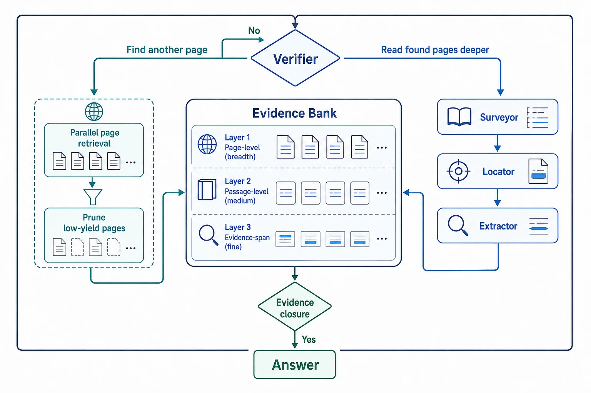

# D2-ScaleAgent: Dual-Dimensional Scaling for Long Document Understanding

*Published 17 Aug 2026 · Iterative Reasoning & Verification · Importance 3/5 · Full-text reviewed · Confidence medium*

[Paper](https://arxiv.org/abs/2608.16417)

> **TL;DR.** D2-ScaleAgent gives a long-document RAG controller a useful distinction: unresolved evidence may require **another page** or **deeper inspection of a page already found**. A Verifier reads a multi-granularity Evidence Bank and routes between those two actions. The package performs well, but current controls do not separate this routing policy from richer state, more operations, and additional adaptive compute.

| 30-second verdict | |
|---|---|
| **Why this paper matters** | It converts “search more” into an evidence-state decision over breadth versus depth. |
| **Strongest evidence** | On MMLongBench-Doc, GPT-4o falls from **52.0 to 44.1** when the Verifier loop is removed; other component removals land at 46.5–47.5. |
| **Biggest caveat** | Baselines are not matched on pages, interface, calls, tokens, latency, or Evidence Bank state; Gemini direct VQA wins two individual datasets. |

**How to read this figure.** The Evidence Bank is the shared state, not a passive log. The Verifier decides whether the missing evidence is outside the current page set or inside pages that need finer inspection; new evidence returns to the same bank before closure is checked again.

**Compared with.** Fixed multimodal RAG and iterative seeker/inspector systems that are not resource-matched on this exact state and operation set.

**Do not over-read.** The figure describes the proposed mechanism. It does not show that the Verifier alone causes the gain, that closure guarantees correctness, or that the loop is cheaper.

## Research question

When long-document evidence is incomplete, can a controller distinguish **coverage failure** from **inspection-resolution failure** and allocate retrieval/reasoning accordingly?

This is more precise than asking whether test-time compute should scale. It asks what observable state tells the system *where* to spend the next unit of compute.

## Research delta

The smallest delta is an explicit `breadth gap ↔ depth gap` decision over a multi-granularity Evidence Bank.

- Breadth gaps create weighted attribute queries, parallel page retrieval, rank fusion, and pruning.
- Depth gaps allocate Surveyor, Locator, or Extractor to page-, region-, or atomic-evidence inspection.
- Candidate-set stability can stop retrieval expansion; evidence completeness and declared gaps control answer readiness.

The contribution is therefore the **combined routing-and-state package**, not multi-agent decomposition by itself.

## Mechanism

**Control flow.** `initial page retrieval → Evidence Bank → Verifier gap classification → outward retrieval or inward inspection → state update → closure check → answer`

The Evidence Bank records evidence at several resolutions together with completeness and the unresolved gap. The Verifier sees that state after each round. An outward route can decompose the need into up to six attributes and retrieve them in parallel; an inward route chooses a reader with the required granularity.

The important systems boundary is that each component changes both information and work. Removing the Verifier also changes which pages/regions are observed and how much compute is realized.

## Evidence & attribution

| Claim | Evidence | Closest control | Assessment |
|---|---|---|---|
| The combined adaptive package helps | Highest mean in all four Table-1 base-model blocks | Fixed/direct long-document baselines | Supported, but not resource matched |
| The Verifier loop is load-bearing | MMLongBench-Doc **52.0 → 44.1** without it | Internal ablation | Strong package evidence; weak policy isolation |
| Retrieval scaling matters | **52.0 → 46.8** without it; PaperTab **47.5 → 42.4** | Internal ablation | Supported in tested settings |
| More agentic execution always wins | Gemini VQA beats D2 on MMLongBench-Doc and LongDocURL | Direct VQA | **Not supported** |
| The method is efficient | 21.4K tokens / 16.22 s on one task profile | No matched baseline cost table | **Unproven** |

Table 3 reports D2's own GPT-4o effort on MMLongBench-Doc: 1.33 retrieval rounds, 1.51/1.12/0.63 Surveyor/Locator/Extractor calls, 1.76 Verifier calls, 5.02 routing-agent calls, 21.4K tokens, and 16.22 seconds. These numbers make the mechanism auditable, but they do not establish a cost-quality frontier because comparable baselines are missing.

## Where it fits

`S2G-RAG sufficiency/gaps → RAAC progress/stagnation → D2 breadth/depth allocation`

S2G-RAG asks whether evidence is sufficient and what is missing. RAAC asks whether search is still progressing. D2 adds a finer allocation question: does the current gap require expanding the page set or changing inspection resolution?

That is a useful early signal for **evidence-sufficiency routing**, not yet a durable trend.

## Open question

The decisive experiment would hold the model, page candidates, Evidence Bank schema, context delivery, and total tokens/latency fixed while varying only the router:

`fixed alternation ↔ random matched-compute routing ↔ heuristic gap routing ↔ learned/verifier routing`.

Until then, the evidence supports the architecture package more strongly than the specific routing policy.

<strong>Evidence & provenance</strong>

Full arXiv v1 PDF reviewed. Load-bearing locations: Figure 2 and Sections 3.1–3.4; Algorithm 1; Tables 1–4; Appendix resource limits; limitations. No official code/project was verified.

