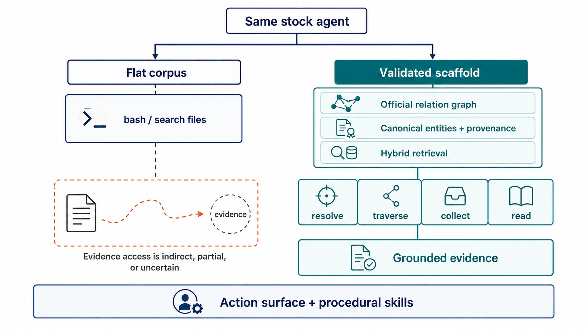

# CTIFoundry：先让 Evidence Path 可操作，再谈 Controller

**中文** | [English](2608.18613.md) · [返回首页](../README.md) · [Research Library](../library/README.md)

[Paper](https://arxiv.org/abs/2608.18613) · **Importance: 4/5**

> **Research delta.** CTIFoundry 把 authoritative relation、canonical entity、provenance chunk 与 hybrid retrieval 在 offline 阶段 materialize，再通过 resolve / traverse / collect / read 等 typed operations 暴露给同一个 stock agent。最稳的 claim 属于整个 scaffold + interface + skill package，而不是某个新 policy。

**如何读图。** 两侧 agent 与 frozen corpus 相同。右侧先把 relation、entity/provenance 与 retrieval surface 变成可操作 state；左侧 flat files 并非找不到证据，但 evidence path 更间接，也不直接对应任务语义。

**与什么比较。** Stock mini-swe-agent 通过 bash 访问 flat files，以及 tools-only / skills-only 2×2 ablation。

**不要过度解读。** 图不表示 graph structure 单独造成增益；typed output、tool description、prompt 与 user-turn procedural skills 都是 treatment。

## Problem

Flat chunk/file access 会把 official cross-reference、alias、entity provenance 与 multi-document collection 隐藏在 generic search 后面。Agent 即使找到看似相关的 report，也可能没有显式操作去 traverse authoritative edge 或收集所有提及某实体的 evidence。

## Mechanism

- 四个 authoritative KB → 6,044 nodes / 7,097 typed edges。
- 321 reports → 688 grounded chunks / 4,868 canonical entities。
- Query-time tools：resolve、get、neighbors、search KB、search chunks、collect mentions、read report。
- 三类 user-turn skills：entity linking、attribution、multi-document synthesis。

`static playbook → resolve/search → traverse or collect/read → verify provenance → answer`

Task-to-skill routing 是静态的，因此不应称为 learned adaptive controller。

## Closest comparison

最接近的对照是同一个 stock mini-swe-agent 通过 bash 访问 flat corpus；2×2 的 base / tools / skills / full 网格进一步拆出 procedural skills 与 operation surface 的互补性。但 tools 分支内部仍同时改变 materialized state、typed operations、输出和描述。

## Decisive evidence

| Claim | Evidence | Closest control | 判断 |
|---|---|---|---|
| 完整 package 有效 | 四模型 **+0.190–0.275 F1** | 同 stock agent + flat bash | CTIConnect 内强证据 |
| Tools 与 skills 都有贡献 | **0.610 / 0.746 / 0.672 / 0.829** | 2×2 | 强 package decomposition |
| Official edges 是关键 evidence path | Forward entity-link 接近 0.95–1.00 | flat access | 有范围的强证据 |
| 所有 CTI task 都提升 | MLA flat/worse，多项 attribution regression | negative task cells | **不支持** |
| 生命周期更便宜 | Offline build 1.42M tokens / $1.86 | 无 matched lifecycle table | **未证明** |

最大的 attribution 风险是 treatment bundle：materialized graph/entity/index、七个 typed tools、structured result、tool descriptions、system prompt 与 user-turn skills 同时改变。2×2 说明 tools 与 skills 有互补性，但仍未拆开 tools 内部各因素。

## Field-map consequence

CTIFoundry 与 VisDocAgentBench 提供了两个独立 setting 的证据，共同强化 Interface resolution：

`opaque top-k / flat files ↔ search / resolve / traverse / inspect / collect / read`

这不是说 rich interface 一定优于强 static retrieval，而是提醒 researcher：如果 operation surface 与 output contract 不匹配，policy attribution 在 controller 动作前就已经失效。

## What remains unproven

Decisive experiment 应正交化：

`flat/materialized corpus state × generic/typed operation surface × no/generic/task-specific skills`

并固定 output schema、prompt placement、model 和 offline+online 总成本；同时测 incremental update 与 stale relation。没有这些，结论仍应限定在 frozen CTIConnect setting。

## Related reading

- [Direct Corpus Interaction](2605.05242.md)：flat corpus + generic file operations 的强基线。
- [LLM-Wiki](2605.25480.md)：把文档编译成 linked environment 并暴露 search/read/traversal。
- [VisDocAgentBench](2608.17889.zh.md)：在视觉页面 setting 中检验 search/inspect evidence path。
