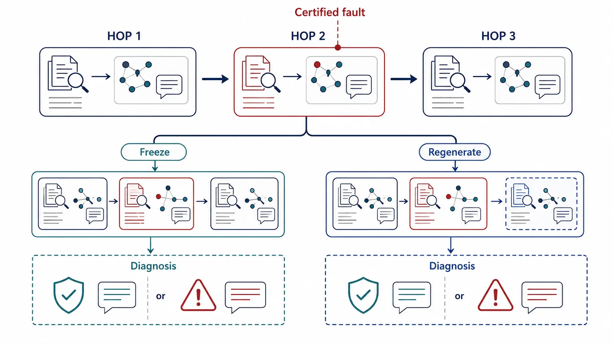

# When Failures Propagate: Causal Failure Attribution in Agentic Retrieval-Augmented Generation

*Published 20 Aug 2026 · Evaluation & Analysis · Importance 4/5 · Full-text reviewed · Confidence medium*

[Paper](https://arxiv.org/abs/2608.20627) · [Artifact](https://github.com/anote-ai/Research-AgenticRAG)

> **TL;DR.** Certified hop faults and counterfactual reruns show that post-hoc answer coverage loses exact-hop information after failure propagation. Active probes retain partial signal, but their denominators, compute, and harness are not matched.

| 30-second verdict | |
|---|---|
| **Why this paper matters** | It turns retrieval failure attribution from trace inspection into an intervention problem. |
| **Strongest evidence** | In strict dense Claude/MuSiQue, exact-hop coverage is **0.91/0/0** at hops 1/2/3, while frozen-hop repair retains **0.51/0.25/0.48**. |
| **Biggest caveat** | Only still-failed traces are scored; later clean retrieval heals many content faults, and active probes spend unmatched compute. |

**How to read this figure.** A known fault is injected at one hop. The lower branches intervene differently: one freezes the corrupted evidence while continuing, the other regenerates the downstream suffix; both may diagnose correctly or fail.

**Compared with.** Post-hoc answer coverage and cross-family trace judging on the same failed traces.

**Do not over-read.** Neither intervention always repairs or localizes the fault, and the experiment conditions on trajectories that remain failed.

## Research question

After a retrieval fault changes later search and reasoning, which hop can still be identified as the cause of the final failure?

## Research delta

The benchmark injects a certified structural or content fault at a chosen hop, then compares passive trace diagnosis with two counterfactual probes: frozen-hop continuation and suffix regeneration. That makes failure origin executable rather than inferred from final-answer overlap.

## Mechanism

`run agent → inject hop fault → retain failed traces → freeze or regenerate suffix → compare outcome → attribute hop`

## Evidence & attribution

| Claim | Evidence | Closest control | Assessment |
|---|---|---|---|
| Coverage loses causal depth | 0.91/0/0 exact-hop accuracy | same strict dense failed traces | Supported narrowly |
| Active repair retains signal | frozen 0.51/0.25/0.48 | same traces, extra executions | Partial, compute-unmatched |
| Suffix regeneration always repairs | content hop-2: 0.11 | frozen hop-2: 0.67 | **Not supported** |
| Depth trend is universal | different survivor sets, small cells | cross-depth comparison | **Not established** |

The corpus stays clean during content corruption, so later retrieval heals 54–85% of interventions and changes which examples enter diagnosis. No realized token, tool-call, latency, dollar, or total experiment-cost table closes the active-versus-passive comparison.

## Where it fits

`observational trace label → certified intervention → propagation-conditioned attribution`

This is an early signal for **propagation-conditioned failure attribution** and a useful causal-evaluation coordinate, not a universal ranking of diagnosers.

## Open question

Can a preregistered model×retriever×dataset matrix compare diagnosis at fixed interventions and matched probe budgets, report all healed and failed trajectories, and separate coverage, retrieval healing, reasoning propagation, and positional judge bias?

