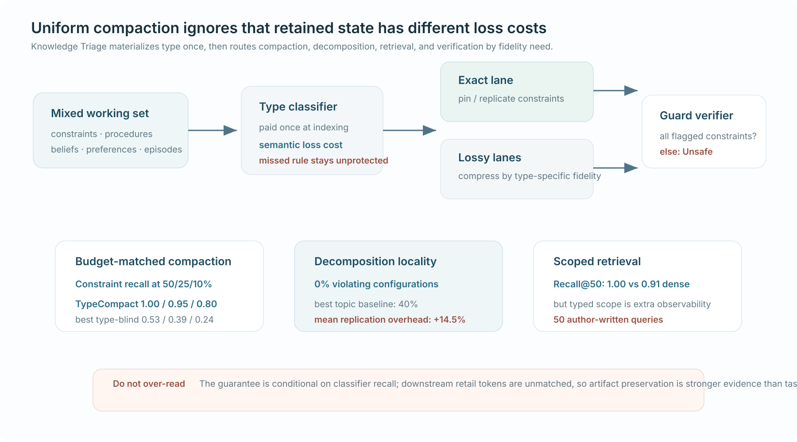

# The Compaction Cliff in Long-Running AI Agent Memory

*发表于 2026-08-24 · 迭代推理与验证 · 重要性 4/5 · 已阅读全文 · 置信度：中*

[论文](https://arxiv.org/abs/2608.22752) · [代码](https://github.com/searchsim-org/cikm26-knowledge-triage) · [CIKM](https://doi.org/10.1145/3799682.3840567)

> **TL;DR。** 统一压缩会比其他 agent state 更快地抹掉约束。在相同输出预算下，TypeCompact 在 50/25/10% 压缩率保留约束的 recall 为 **1.00/0.95/0.80**，最强 type-blind 结果只有 **0.53/0.39/0.24**。artifact 层证据很强，但保证取决于 classifier recall，下游行为比较也没有完全匹配 token。

| 30 秒判断 | |
|---|---|
| **为什么重要** | retained token 的未来价值和保真要求不同，统一 rate-distortion 并不合理。 |
| **最强证据** | budget-matched compaction 在各压缩率保留约束 2–4 倍，五轮后仍有 96%。 |
| **最大限制** | typed metadata 与分类本身是额外 materialization；保证只覆盖被识别出的约束。 |

**读图方式。** 上方是机制：先分类，再让约束进入精确保留通道，最后验证；下方把 budget-matched compaction 与 metadata-confounded retrieval/下游结果分开。

**不要过度解读。** 保证依赖 classifier recall，也不能据此声称下游 token-matched superiority。

## Problem

当长时程 agent 必须压缩、切分或检索状态时，能否精确保留安全约束，而不对 episodic log 与 preference 付出同样保真成本？

## 研究增量

增量是**跨三类 context operation 的 typed retention policy**：先分类，再进行约束精确保留、跨分区复制、优先检索与 guard verification。

## Mechanism

**控制流。** `分类 → 按类型 compact/decompose/retrieve → 验证约束 → 接受或标记 unsafe`

TypeRetrieve 并非只改变相同 score：它获得基线不可见的 type/topic 与 query scope 元数据，先 pin 所有适用约束，再用 relevance 填剩余位置。

## Closest comparison

最近对照是相同 compaction budget 下的 type-blind retriever；比较仍需注意 typed method 独有的约束标签与下游 context budget。

## Decisive evidence

| 主张 | 证据 | 最近控制 | 判断 |
|---|---|---|---|
| typed compaction 保留约束 | **1.00/0.95/0.80** | 相同输入与输出预算 | 强 artifact 证据 |
| decomposition 保持 locality | 0% configs 违规，topic baseline 40% | 相同 topic signal | 成立；平均 +14.5% tokens |
| retrieval 提升约束 recall | R@50 **1.00 vs 0.91** dense | 相同 dense substrate | interface/metadata package |
| retail 提升隔离了 typing | 37.7% vs 29.2%，但 1,136 vs 669 tokens | hierarchical | **未隔离** |

分类成本在 indexing 时支付，却没有计入 operator 的 0-token 表。人工共识与自动保留判定只在 79% sample 上一致，不过更严格人工判定反而扩大相对差距。

## Field-map consequence

`retained state → semantic type → fidelity lane → verified materialization`

这是 State persistence 的单篇信号：recoverability 与 reacquisition cost 之外，还存在非对称 loss cost。

## What remains unproven

在自然演化企业状态中匹配 tokens 与 metadata，独立改变 classifier visibility、pinning、compression policy 与 verifier，并统计漏检伤害、索引调用、更新时间、存储和美元成本。

<strong>证据与来源</strong>

已阅读 arXiv v1/CIKM 全文：Algorithms 1–3、Tables 5–10、人工审计、资源表与保证条件。已验证官方代码/数据身份。

## Related reading

[Context Compression Cost](2608.16370.zh.md) · [Research Map](../categories/README.md)
