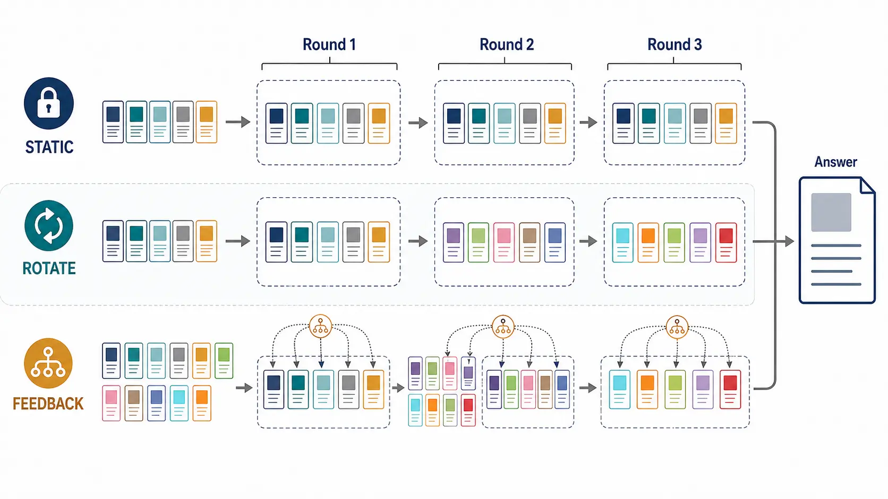

# The Laws of Context Allocation: Causal Measurement and Closed-Loop Orchestration in Generative Search

*Published 24 Aug 2026 · Iterative Reasoning & Verification · Importance 4/5 · Full-text reviewed · Confidence medium*

[Paper](https://arxiv.org/abs/2608.23252) · [Code](https://github.com/PeiYangLiu/ascp)

> **TL;DR.** Fresh evidence allocation is the robust result: under matched context size and rounds, rotation beats fixed reuse. The full feedback scheduler is statistically tied with deep rotation, and their matched cost difference is not reported. Separately, the equal-slot sequential `(2,12)` package beats one-shot `(24,1)` but takes 17.5s versus 1.7s, so that comparison does not isolate timing from interface and test-time compute.

| 30-second verdict | |
|---|---|
| **Why this paper matters** | It isolates evidence freshness under matched rounds and bounded context, then tests whether feedback adds beyond strong rotation. |
| **Strongest evidence** | At `k=2,T=12`, rotation reaches **0.397 PR** versus **0.257** for fixed reuse; equal-volume `(2,12)` beats `(24,1)` by **0.144**. |
| **Biggest caveat** | Full ASCP is only **0.309 vs 0.303** for deep rotation (`q=0.343`), with no matched resource delta; 17.5s versus 1.7s belongs to sequential `(2,12)` versus one-shot `(24,1)`. |

**How to read this figure.** Each row receives the same bounded context across rounds. Static reuse preserves the same cards; rotation makes freshness explicit; feedback estimates marginal value before composing the next portfolio.

**Compared with.** Fixed evidence reuse and deep fresh-evidence rotation under matched context size and number of rounds.

**Do not over-read.** The image does not claim the feedback scheduler beats rotation; the terminal result is statistically tied.

## Research question

When repeated generation has a fixed context budget, does quality come from a larger context, fresh evidence across rounds, or feedback-conditioned selection?

## Research delta

ASCP makes context allocation experimentally separable. Fixed-response leave-one-out attribution estimates marginal evidence value; a submodular scheduler selects the next portfolio; optional steering affects decoding. More importantly, the factorial comparison holds evidence volume and rounds fixed while changing reuse versus rotation.

## Mechanism

`retrieve candidates → estimate marginal value → allocate bounded context → generate feedback → schedule next portfolio → answer`

The leave-one-out teacher-forced stage adds `k+1` passes per round. That cost is part of the mechanism, not an incidental implementation detail.

## Evidence & attribution

| Claim | Evidence | Closest control | Assessment |
|---|---|---|---|
| Fresh evidence matters | 0.397 vs 0.257 PR at `(2,12)` | same rounds/context, rotation vs fixed | Strong |
| Repeated allocation package beats one-shot at equal slots | `(2,12)` beats `(24,1)` by 0.144 | equal total evidence slots, but different generation count/interface/compute | Supported as a compute/interface package, not timing alone |
| Feedback scheduling adds terminal quality | full 0.309 vs deep rotation 0.303, `q=0.343` | strong rotation policy | **Not established** |
| Scheduler alone helps | 0.300 vs rotation 0.303, `q=0.717` | no steering | **Not supported** |

The freshness effect replicates at 14B and 32B. Resource accounting still limits deployment claims: the sequential `(2,12)` package takes about 17.5s versus 1.7s for one-shot `(24,1)`, uses roughly 1.5× tokens, and adds teacher-forced passes. The paper does not report the matched cost difference between full ASCP and deep rotation.

## Where it fits

`fixed context → fresh-evidence rotation → feedback-conditioned allocation`

This is an early signal for **fresh-evidence context allocation**, not evidence that a complex controller is already necessary. It sharpens the Resource accounting and Adaptivity placement questions without changing the durable Field Map.

## Open question

Can a low-cost scheduler beat an optimized rotation policy under matched retrieved evidence, calls, tokens, latency, and final decoding—then reproduce on open-domain tasks where evidence quality, not only allocation, changes online?
