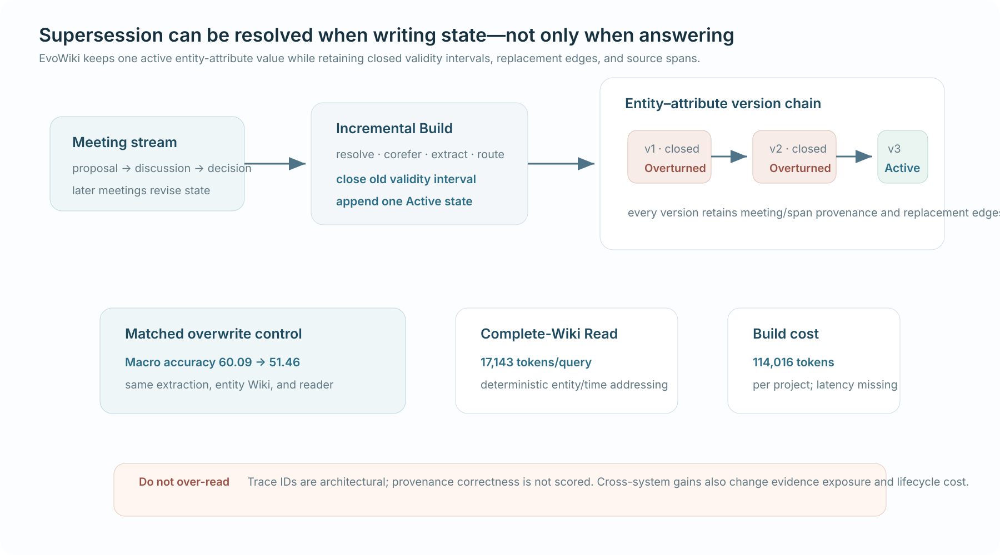

# EvoWiki: Incremental State Overwriting and Traceable Question Answering for Cross-Meeting Knowledge Evolution

*Published 24 Aug 2026 · Iterative Reasoning & Verification · Importance 4/5 · Full-text reviewed · Confidence medium*

[Paper](https://arxiv.org/abs/2608.23265)

> **TL;DR.** EvoWiki materializes one current-valid entity state during incremental Build while retaining superseded versions and provenance. Its matched no-overwrite control drops macro judge accuracy from **60.09 to 51.46**, supporting lifecycle invalidation. The full package reads substantially more evidence than top-k RAG, traceability is not directly scored, and build/update economics are incomplete.

| 30-second verdict | |
|---|---|
| **Why this paper matters** | Retaining history and deciding what remains operative are separate state-management problems. |
| **Strongest evidence** | Same extraction, coreference, entity Wiki, and reader; disabling overwrite costs **8.63 points**. |
| **Biggest caveat** | Cross-system gains bundle structure, complete-Wiki exposure, and different lifecycle budgets. |

**How to read this figure.** Build closes old validity intervals and keeps one Active state; the evidence band distinguishes the matched overwrite ablation from unmatched complete-Wiki and lifecycle costs.

**Do not over-read.** Provenance identifiers are part of the mechanism, but citation correctness was not evaluated.

## Research question

Can a system answer from the current valid state while preserving the superseded history needed to audit how decisions, risks, and ownership changed?

## Research delta

Relative to StateMem, the smallest delta is **incremental write-time supersession materialization** rather than answer-time value-chain resolution.

## Mechanism

**Control flow.** `meeting → resolve/corefer/extract → route updates → close old validity → append active state → address current/history → answer`

Each entity-attribute pair has at most one active value; replaced values remain in a version chain with meeting/span provenance and replacement edges. Read uses deterministic structured addressing over the complete Wiki.

## Evidence & attribution

| Claim | Evidence | Closest control | Assessment |
|---|---|---|---|
| Overwrite helps current-state QA | Full **60.09**, no-overwrite **51.46** macro | Same upstream structure and reader | Strong internal evidence |
| Whole package beats baselines | +9.72/+10.00 macro across readers | Native pipeline baselines | System-level only |
| Traceability is correct | State IDs/provenance emitted, but not scored | None | **Unproven** |
| Lifecycle is cheaper | 17,143 Read tokens, 114,016 Build tokens/project | Direct and RAG rows | Incomplete tradeoff |

LongMemEval supplies the strongest external evidence. MeetingQA/ELITR gains over full context are only about one point. Many residual errors originate in Build extraction and overwrite, so deterministic Read cannot recover omitted state.

## Where it fits

`StateMem answer-time precedence ↔ EvoWiki write-time active-state materialization`

Together these independently reinforce supersession-aware state assembly, without establishing universal structured-memory superiority.

## Open question

Hold transcript, extraction, reader, calls, evidence tokens, and output format fixed while varying answer-time versus write-time supersession. Measure provenance accuracy, update latency, storage, break-even queries, and recovery after counterfactual edits.

<strong>Evidence & provenance</strong>

Full arXiv v1 text reviewed: state overwrite protocol, Table 5 ablation, six-dataset results, judge robustness, error attribution, and Table 7 lifecycle costs. No released project/dataset verified.

