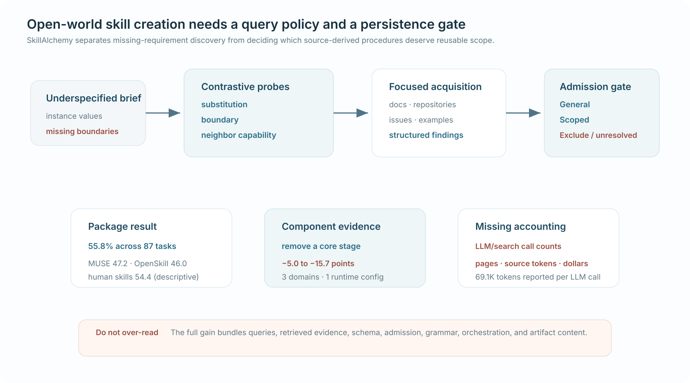

# SkillAlchemy: Open-World Agent Skill Creation

*发表于 2026-08-24 · 规划与查询构造 · 重要性 4/5 · 已阅读全文 · 置信度：中*

[论文](https://arxiv.org/abs/2608.23417)

> **TL;DR。** SkillAlchemy 把 underspecified brief 转成 contrastive acquisition targets，再只按证据支持的 scope 接纳 finding。87 个任务上达到 **55.8%**，最强自动 baseline 为 **47.2%**；去掉核心 stage 会下降 5.0–15.7 点。完整 package 同时改变 query、找到的 evidence、orchestration、schema 与 artifact，creation cost 也不完整。

| 30 秒判断 | |
|---|---|
| **为什么重要** | Web-grounded skill creation 需要“搜什么”的 policy，也需要“什么能成为持久 procedure”的 gate。 |
| **最强证据** | 核心 stage 消融共享 source-access scope 与 creation budget，每个 stage 都在三个领域产生下降。 |
| **最大限制** | 没有让各方法读取相同 source documents、token mass、calls 与相同长度 skill。 |

**读图方式。** requirement probe 改变搜什么，admission 决定什么成为持久 procedure；下方把 package accuracy、component evidence 与缺失成本分开。

**不要过度解读。** 不能把完整收益单独归因给 retrieval 或 admission。

## Problem

creator 如何发现 brief 遗漏的 requirement，又不把单个 source 的 local practice 提升成通用 instruction？

## 研究增量

OpenSkill 已经会搜索外部来源。SkillAlchemy 的更小增量是：

`candidate factor → contrast/boundary/neighbor probe → focused acquisition → General/Scoped/Exclude admission`

## Mechanism

**控制流。** `brief → operational frame → contrastive questions → structured findings → decision-aligned procedures → scope admission → skill package`

finding 保留 context 与 provenance；matched condition 下的冲突保持 unresolved，证据不足也不能授权 generalization。

## Closest comparison

最近对照来自同一系统的 acquisition components ablation；MUSE、OpenSkill 与 no-skill 只提供 package-level 边界，因为来源与预算未完全匹配。

## Decisive evidence

| 主张 | 证据 | 最近控制 | 判断 |
|---|---|---|---|
| package 改善 created skills | **55.8%** vs MUSE 47.2、OpenSkill 46.0、no-skill 35.9 | 自动 skill creators | 强 package 结果 |
| external search 有用 | 同 creator 开 Web **+6.9pp** | creator without Web | 支持 source access |
| 核心 stage 有贡献 | 每个移除 **−5.0 至 −15.7pp** | 同 scope/budget | 最强内部隔离 |
| admission 抗坏来源 | 各 perturbation 0/4 promoted | injected payload | 方向性，小样本 |

Creation 报告 69.1K tokens/LLM call，却没有 call count、pages、source tokens、search/tool calls、dollars 或分阶段成本。四个 runtime configuration 中三项最佳，Media 是明显弱点。

## Field-map consequence

`query formulation → evidence acquisition → persistent procedural materialization`

这是 placement 的 early signal，不是 grammar 或 parallel multi-agent package 的独立因果证据。

## What remains unproven

让所有 creator 读取完全相同的文档、source-token mass、calls 与 artifact length，再独立改变 requirement probing 与 admission，并测 unsupported generalization、held-out transfer、execution success 与完整成本。

<strong>证据与来源</strong>

已阅读 arXiv v1 全文：evaluation isolation、Tables 1–4、component ablations、source perturbations、transfer case 与资源表。论文中未验证到官方项目链接。

## Related reading

[SearchMaster](2608.01822.md) · [Research Map](../categories/README.md)
